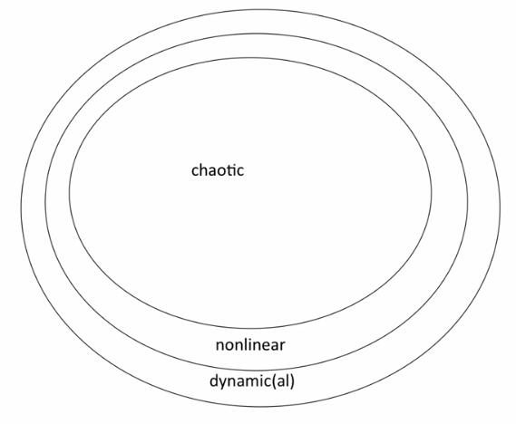
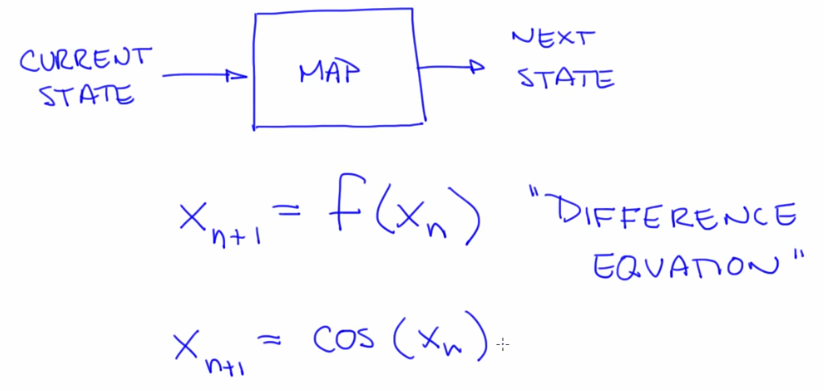
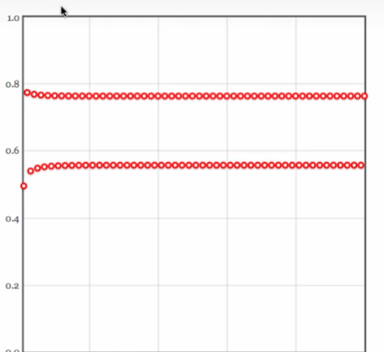
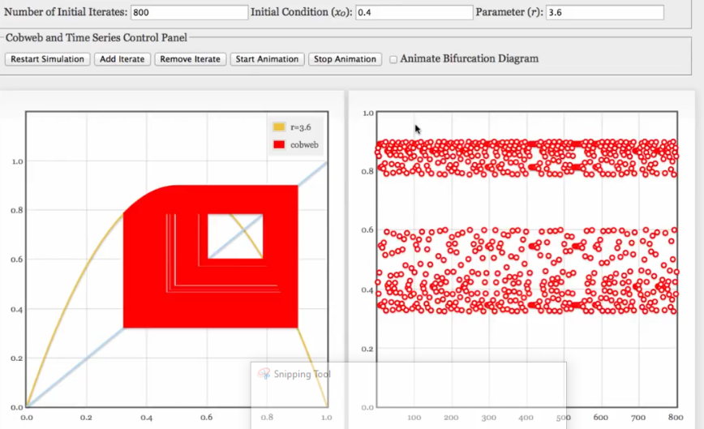

# Course on Nonlinear Dynamics: Mathematical and Computational Approaches

My progress and notes from the [course on nonlinear dynamics](https://www.complexityexplorer.org/courses/100-nonlinear-dynamics-mathematical-and-computational-approaches) offered by the Santa Fe Institute.

- [Terminology](#terminology)
- [Intro](#intro)
- [Maps (Discrete time intervals)](#maps-discrete-time-intervals)
  - [Terms](#terms)

## Terminology

| Term | Definition   |
|---|---|
| Deterministic  | A system that is not random. Cause & Effect are linked. Current state determines future state  |
| Nonlinear | A system that with relationships between variables that matter are nonlinear |
| Dynamic(al) | A system that evolves with time| 

## Intro

- **Chaos** - Complex behavior, arising in a deterministic nonlinear dynamic (NLD) system with 2 properties: sensitive dependence on initial conditions (butterfly effect, trajectory changes based on initial condition) and characteristic structure. Systems that exhibit chaos are ubiquitous
- Systems: 
- Derivatives represent the math of change with time
- NLD is in weather, flows (air,fluid), non linear oscillators (pendula, human heart, fireflies, electronic systems), protein folding etc.
- Complexity (complicated systems with simple behavior) vs Chaos (simple systems with complex behavior)
- Flow (continuous in time) vs Maps (discrete time intervals with no knowledge of state of the system between intervals)

## Maps (Discrete time intervals)

- Difference Equation: xn+1 = f    (xn).
- Logistic Map: xn+1 = R xn(1-xn). Repetition converges to a fixed point from a transient phase. [Try this simulator](./code/Logistic%20Map%20Sim%20-%20Cobweb%20Plots%20and%20the%20Time%20Domain/Cobweb.html)

### Terms

- x0,x1,x2.. -> **Orbit**/Trajectory of the dynamical system. Sequence of **state variables**.
- Logistic map has a single state variable x. Other maps such as the [Henon map](https://en.wikipedia.org/wiki/H%C3%A9non_map) have more than one state variable
- Starting state variable is the **initial condition**
- Repetition converges to a fixed point from a transient phase. A fixed point does not move under the influence of dynamics. An **attracting (stable) fixed point** is one that the system tends to go to (eg. rest). Fixed points move with changing parameter R
- **Transient** -> Fixed results in overshoot/**oscilatory** for higher values of R
- Attractors. Kinds:
  - Attracting fixed points
  - **Basin of attraction**: Different initial points leading to the same fixed point
  - **Periodic orbit** (limit cycle) Period:2(this can be any number based on fixed points)
  - **Chaotic/Strange Attractors** 
- **Bifurcations** - Changes in the topology of the attractor. R is a bifurcation parameter in the logistic map. It affects the dynamic in a fundamental way. Eg. a flooded creek