# Course on Nonlinear Dynamics: Mathematical and Computational Approaches

My progress and notes from the [course on nonlinear dynamics](https://www.complexityexplorer.org/courses/100-nonlinear-dynamics-mathematical-and-computational-approaches) offered by the Santa Fe Institute.

Code files are present [here](./code)

Certification for the course is [here](https://www.complexityexplorer.org/courses/100-nonlinear-dynamics-mathematical-and-computational-approaches/certificates/3759472641)

- [Terminology](#terminology)
- [Learning that made this course very interesting](#learning-that-made-this-course-very-interesting)
- [Intro](#intro)
- [Maps (Discrete time intervals; Modelled using Difference equations)](#maps-discrete-time-intervals-modelled-using-difference-equations)
  - [Concepts](#concepts)
  - [Return Maps](#return-maps)
    - [Time Domain Plots and their return map equivalent](#time-domain-plots-and-their-return-map-equivalent)
  - [Bifurcation Diagram](#bifurcation-diagram)
    - [Feigenbaum and universality](#feigenbaum-and-universality)
      - [Manifestations of Universality of Chaos (Eg. Feigenbaum number)](#manifestations-of-universality-of-chaos-eg-feigenbaum-number)
- [Flows (Continuous time; Modelled using Differential equations)](#flows-continuous-time-modelled-using-differential-equations)
  - [Fundamentals](#fundamentals)
  - [State variables and state space](#state-variables-and-state-space)
  - [ODE and Dynamical system](#ode-and-dynamical-system)
  - [Fixed points and stability](#fixed-points-and-stability)
  - [Saddle points and Eigen vectors](#saddle-points-and-eigen-vectors)
  - [Stable and Unstable Manifolds of Fixed points](#stable-and-unstable-manifolds-of-fixed-points)
  - [Attractors](#attractors)
  - [ODEs, Vector fields and Dynamical landscapes](#odes-vector-fields-and-dynamical-landscapes)
  - [Numerical ODE Solvers](#numerical-ode-solvers)
  - [Two simple ODE solvers: forward and backward Euler](#two-simple-ode-solvers-forward-and-backward-euler)
  - [Solving ODE's of a SHO](#solving-odes-of-a-sho)
  - [ODE Solvers: Error and Adaptation](#ode-solvers-error-and-adaptation)
  - [Production ODE solvers](#production-ode-solvers)
  - [Numerical dynamics and due diligence while picking ODE solvers](#numerical-dynamics-and-due-diligence-while-picking-ode-solvers)
  - [Shadowing and Chaos](#shadowing-and-chaos)
  - [Solving ODE's numerically, Review](#solving-odes-numerically-review)
  - [Dynamics and State space deformation](#dynamics-and-state-space-deformation)
  - [Lyapunov exponents](#lyapunov-exponents)
  - [Sections and Projections](#sections-and-projections)
  - [Unstable periodic orbits](#unstable-periodic-orbits)
  - [Fractals and Chaos](#fractals-and-chaos)
- [Nonlinear time-series analysis](#nonlinear-time-series-analysis)
  - [Time-series analysis and the observer problem](#time-series-analysis-and-the-observer-problem)
  - [Delay - coordinate embedding](#delay---coordinate-embedding)
  - [Topology, diffeomorphisms, and reconstruction of dynamics](#topology-diffeomorphisms-and-reconstruction-of-dynamics)
  - [Estimating Embedding Parameters](#estimating-embedding-parameters)
    - [Choosing the right $\tau$](#choosing-the-right-math-xmlnshttpwwww3org1998mathmathmlsemanticsmrowmiτmimrowannotation-encodingapplicationx-textauannotationsemanticsmathτ)
    - [Choosing the right m (Embedding dimension)](#choosing-the-right-m-embedding-dimension)
  - [Caveats and Extensions](#caveats-and-extensions)
    - [Due diligence required in Non Linear Time Series Analysis](#due-diligence-required-in-non-linear-time-series-analysis)
  - [Computing Fractal Dimensions](#computing-fractal-dimensions)
    - [Capacity Dimension](#capacity-dimension)
    - [Correlation dimension](#correlation-dimension)
  - [Computing Lyapunov exponents](#computing-lyapunov-exponents)
    - [Wolf's method](#wolfs-method)
    - [Kantz method](#kantz-method)
  - [Noise & Filtering](#noise--filtering)
- [Applications](#applications)
  - [Prediction](#prediction)
  - [Control](#control)
    - [OGY Control](#ogy-control)
- [TODO](#todo)

## Terminology

| Term | Definition   |
|---|---|
| Deterministic  | A system that is not random. Cause & Effect are linked. Current state determines future state  |
| Nonlinear | A system that with relationships between variables that matter are nonlinear |
| Dynamic(al) | A system that evolves with time|
| Phase space | Also known as State Space, used to describe evolution of trajectory of dynamical systems. For a standard map, the statespace is the x,y-axes|
| Sparatrix | Curve in state space that separates two different regions|
| Integrable| Not chaotic|
| Disspative| Friction, necessary condition for the existence of attractors but not for the existence of chaos |
| Hamiltonian | Synonym for conservative/non-dissipative|
| Conservation | No friction, Ideal|
| Nonintegrability | Applies to only non-dissipative/hamiltonian systems. Think of it as "can't be solved in closed form/analytically"|
| Non stationarity| Dynamics changing during the process of measurement|

Nonlinearity is a necessary condition for chaos. Not all nonlinear systems are chaotic

Non integrabilitiy (if the ODE is non linear, possible that there might not exist an **analytic** solution) is a necessary and sufficient condition for chaos. Such ODE's are solved **numerically** (with a computer)

3 dimension is a necessary condition for chaos in flows but not maps

Many (not all) chaotic structures have fractal space structure

## Learning that made this course very interesting

Concepts learnt:
maps, return maps, logistic map, bifurcation diagram, time series analysis, dynamical systems, chaos, feigenbaum number, universality, standard maps, flows, [linear algebra,matrices,ODE] in the context on linear dynamics, numerical analysis, dynamics using matrices, delay coordiante embedding, mutual information, cantor set calculations, machine epsilon, lyapunov exponent, delay-coordinate embedding, fractal dimensions and others

``` We use computers to study dynamical systems but computers themselves are dynamical systems and the dynamics are often chaotic ```

- Manifestations of Universality of Chaos
- NLD is in weather, flows (air,fluid), non linear oscillators (pendula, human heart, fireflies, electronic systems), protein folding, classical mechanics (three-body problem, paired black holes) etc.
- The course goes over terminology very carefully (eg. sensitivity to initial conditions) and explains the fundaments of systems. Adds analysis structure to understanding patterns such as the butterfly effect for example.
- NLD developed in the 1960's as a result of computers, which are absolutely essential to solve non-integrable ODE's numerically. Experimental Mathematics relies on the computer as the laboratory
- Problems like an artifical pancreas aid for diabetes are difficult because the response of human body to insulin is non-linear. ODE's have reduced the necessity for animal testing. A very interesting [application](https://www.youtube.com/watch?v=a790FlSLIQo) of ODE's. The role of computers in such applications is amazing!
- Using stable and unstable manifolds to design [spacecraft trajectories](https://www.youtube.com/watch?v=PRbAag_crbo) (with Jeff Parker)
- NLD is interdisciplinary from Economics, Medicine, Mechanical systems and others from the field trips
- Nyquist rate only holds good for linear systems
- Finding Cache Misses using k-neighbour Lorenz Method of Averages is remarkable 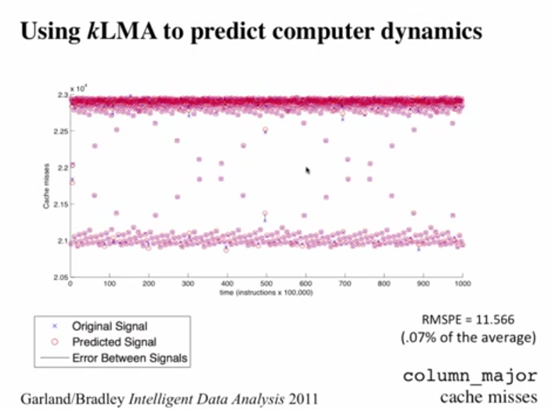
- An almost pattern that does not repeat? **CHAOS**. **Computers are dynamical systems** 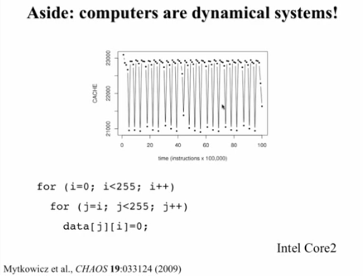
- From Saturn's moon Hyperion, to asteroids, to the human body to the computers, NLD is everywhere
- Chaos and Control: To control PLL!! 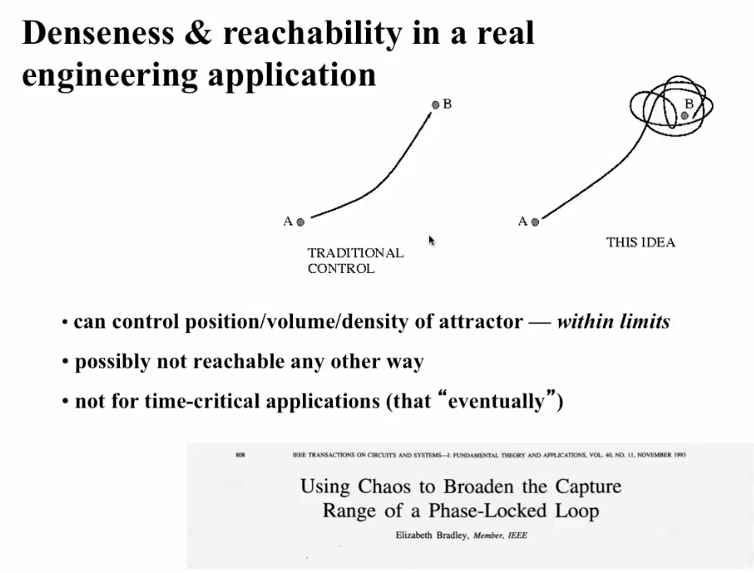

## Intro

- **Chaos** - Complex behavior, arising in a deterministic nonlinear dynamic (NLD) system with 2 properties: **sensitive dependence on initial conditions** (butterfly effect, trajectory changes based on initial condition) and characteristic structure. Systems that exhibit chaos are ubiquitous
- Systems: 
- Derivatives represent the math of change with time
- **Complexity** (complicated systems with simple behavior, larger scale structure that emerges) **vs Chaos** (simple systems (not a lot of state variables/moving parts) with complex behavior)
- Flow (continuous in time) vs Maps (discrete time intervals with no knowledge of state of the system between intervals)


## Maps (Discrete time intervals; Modelled using Difference equations)

- Difference Equation: x<sub>n+1</sub> = f    (x<sub>n</sub>).
- Logistic Map: x<sub>n+1</sub> = R x<sub>n</sub>(1-x<sub>n</sub>). Repetition converges to a fixed point from a transient phase. [Try this simulator](./code/Logistic%20Map%20Sim%20-%20Cobweb%20Plots%20and%20the%20Time%20Domain/Cobweb.html)

### Concepts

- x0,x1,x2.. -> **Orbit**/Trajectory of the dynamical system. Sequence of **state variables**.
- Logistic map has a single state variable x. Other maps such as the [Henon map](https://en.wikipedia.org/wiki/H%C3%A9non_map) have more than one state variable
- Starting state variable is the **initial condition**
- Repetition converges to a fixed point from a transient phase. A fixed point does not move under the influence of dynamics. An **attracting (stable) fixed point** is one that the system tends to go to (eg. rest). Fixed points move with changing parameter R. A fixed point of a map $f$ is a state $x^{*}$ such that $x^{*}=f\left(x^{*}\right)$
- **Transient** -> Fixed results in overshoot/**oscilatory** for higher values of R
- Attractors. Kinds:
  - Attracting fixed points
  - **Basin of attraction**: Different initial points leading to the same fixed point
  - **Periodic orbit** (limit cycle) Period:2(this can be any number based on fixed points)
  - **Chaotic/Strange Attractors** 
- **Bifurcations** - Changes in the topology of the attractor. R is a bifurcation parameter in the logistic map. It affects the dynamic in a fundamental way. Eg. a flooded creek
- Few **representations** to understand NLD:
  - Physical space (Eg. Pendulum)
  - Time Domain Plots ( $x_n$ vs n ) - Shows overall temporal pattern of the iterates
    - Brings out overall behavior of iterates
  - Return Maps (Correlation Plot/ Cobweb diagram) ( $x_{n+1}$ vs $x_n$ (First because of n+1, We can also have second return map etc))
    - Brings out correlation between succesive iterates, geometry of iterates why they go where they go
  - Bifurcation diagram ( $x_n$ vs R). View of a time plot from the side.
    - What changes about the asymptotic behavior of the trajectory as R changes including bifurcations

### Return Maps

- Logistic Map 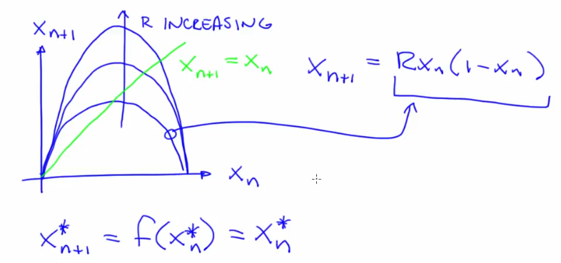 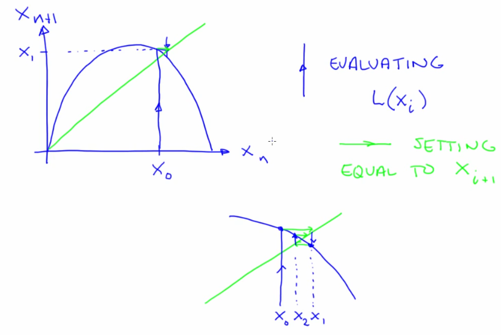
- 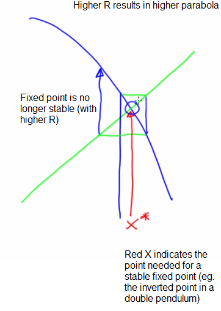
- Fixed point condition, xn+1* = xn* (where dynamics dont move)
  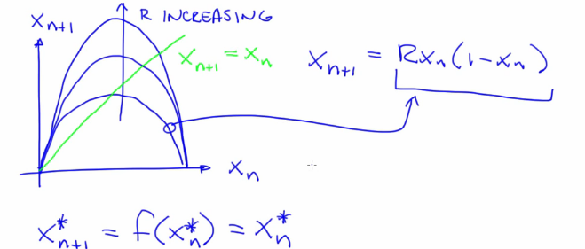
- Points on the curve signify where the iterates are. This is a fixed point (not periodic) because nearby iterates are converging to the same point 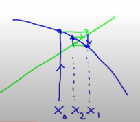
- The spacing between points and tendency to converge will differentiate fixed points from periodic orbits.Slope of the blue curve (parabola) at the fixed point determines if it's a fixed point or not
- Green line indicates the fixed points of the system. Slope of the blue curve (function/parabola) at the intersection of green point and parabola determines whether it is a stable (cobweb) or unstable fixed point
- Periodic Orbit on a return map 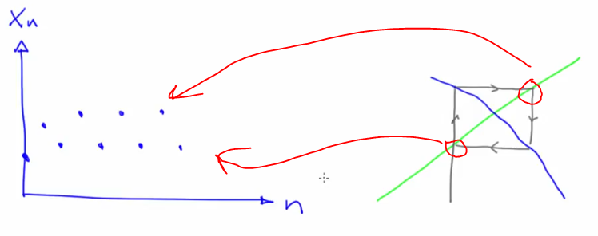
- Second return map example 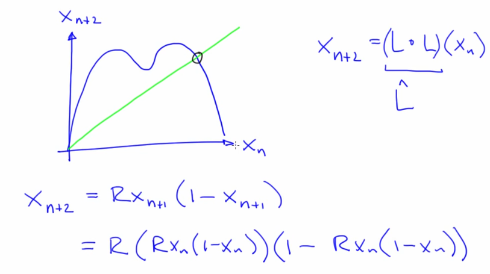
- Removing transient points in a cobweb plot will make periodic orbits clearly visible. Example: 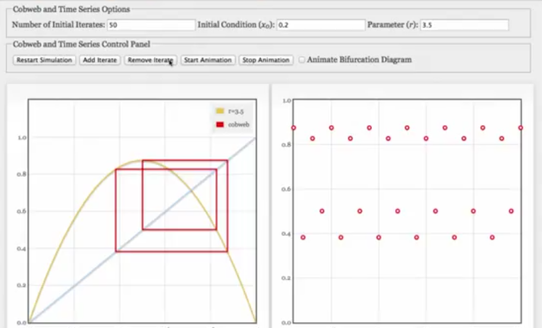

#### Time Domain Plots and their return map equivalent

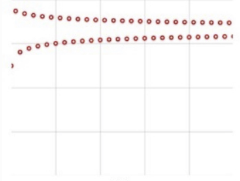
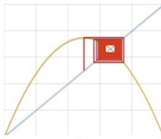
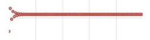
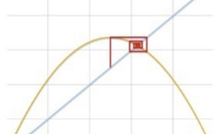
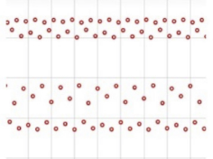
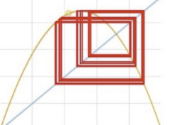
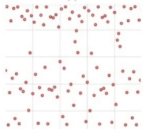
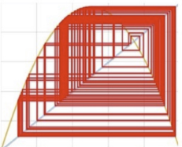

### Bifurcation Diagram

- Bifurcation point is the point where a fixed point splits into periodic 2 orbit in a xn vs R app
- Bifurcation diagram ignores the transient curve
  - Near a bifurcation point, we notice thickening if insufficient transient is removed
- Fractals are self-similar patterns that become visible in bifurcation diagrams. These are non-integer Hausdorff dimension. Fractals are in nature and also in computer graphics to analogue nature (eg. mandelbrot set)
  - Many (most) chaotic systems have fractal state-space structure. But not all.

- 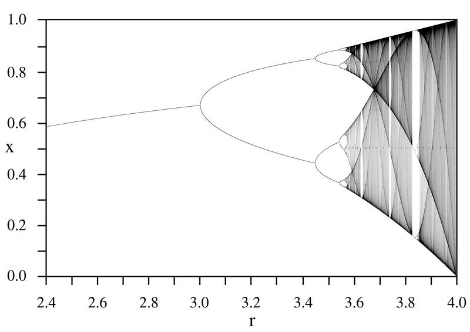
- Logistic Map BD features: 
  - Periodic orbit of 2 in fixed points (2,4,8)
  - Periodic orbit of 3 amongst chaotic points (3,6,12)
  - It is a fractal with period-doubling cascades
  - Dark veils in the logistic map bifurcation diagram are unstable perioid orbits
  - Bifurcations in the cascade are getting smaller (closer) as R increases (and period increases with R)
- Initial points (x0) within the same basin of attractors reach the same fixed point.
- As R increases in logistic map, we see oscillatory convergence and period doubling as visible from both time series and bd
- Differnet x0 follows the same path but in a different order which is why bd are useful compared to timeseries plots

**Important aspects of NLD:**
- **Structure of chaotic attractors**
- **Sensitive dependance on initial conditions**

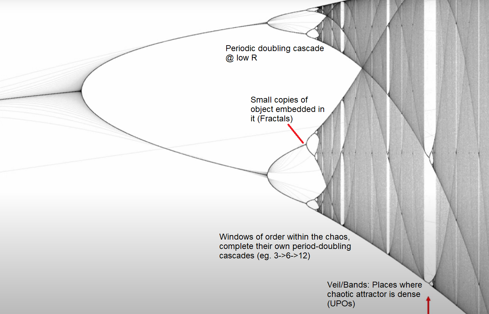

#### Feigenbaum and universality

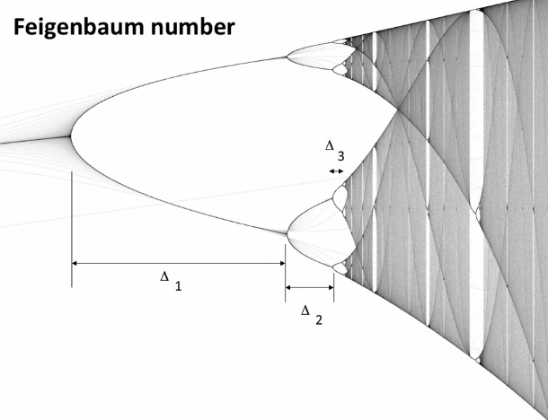

$$\lim _{n \rightarrow \infty} \frac{\Delta_{n}}{\Delta_{n+1}}=4.66$$

i.e Widths of the pitchforks.

Feigenbaum number holds true for any **1-D** **map** with a quadratic maximum eg. logistic map, sine map and any other map that looks like a parabola at it's maximum

##### Manifestations of Universality of Chaos (Eg. Feigenbaum number)

Systems as diverse as orbiting moons, human heart, pendulum, hurricanes all act the same in the throws of chaos. This is extremely fascinating.

Example of 2D map: Smale's horshoe kneading moves initial points closer to far apart and vice versa. The stretching and folding that creates this is a paradigm in chaos. **Its the cause of sensitive dependence on initial conditions**. In a logistic map, the quadratic map (like fingers) kneads the unit interval (like dough).

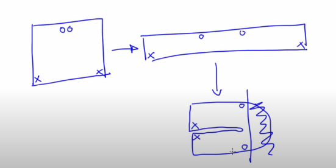

Maps are also useful in modelling physical systems. A good example of this is the standard map that can be used to model an experiment where a pendulum in free space is hit periodically in time (meaning different points in its path) and to model the amplitude and angular momentum impact (extend this to effect of planets on asteroid movement)

Standard map is non-disspative (no attractors) but there is still chaos

## Flows (Continuous time; Modelled using Differential equations)

### Fundamentals

- Constraints in sampling rate/data acquisitions induces the need to rely on discretization to an extent
- State variables in Flows example
  - The double pendulum can be modelled using 4 state variables (Angle of main bob, Angle of second bob relative to main, Angular momentum of both bobs since position alone cannot convey all possible states)
  - **The state variables *EVOLVE* continuosly under the *influence* of the dynamical system**
  - The trajectory of the system is the progression (continuous unlike maps) of states that the dynamical system goes through.
  - The dynamical system goes through a transient (oscillations) before reaching an attractor (stable fixed point at rest). This is only when the initial point is in the basin of attraction (in case of a pendulum this is basically without raising the bob above)
  - Stable fixed points shrink perturbation. Unstable fixed points (3 for example, b,c,d) 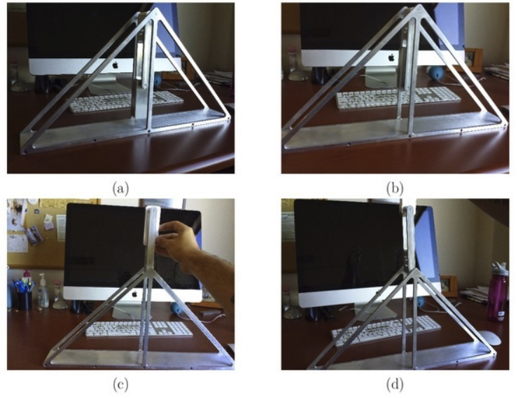
  - A stable fixed point can become chaotic or move to a perioic orbit (at a bifurcation parameter think of this as moving the table on which the pendulum was placed at a frequency, the bob will eventually move). Similarly an unstable fixed point can become stable at a different condition

### State variables and state space

- A powerful representation in the field of non linear dynamics. Supresses time and reveals patterns that emerge as the system evolves with time. Focus of exploration is important while choosing state space in a dynamical system (think of eyes in a potrait drawing)
- Simple pendulum example for state space potrait
  - The states at odd multiples of pi are unstable fixed points and even multiples of pi (theta w.r.t rest condition) are repeated stable fixed points
  - The angular momentum values translate into ellipses around the origin
  - State representation of a simple pendulum 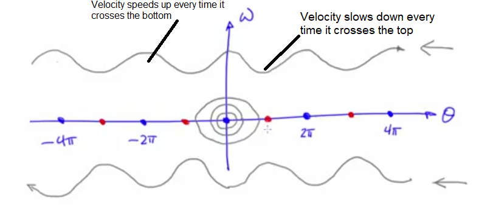
  - Assumes no friction but real device shows damped oscillation 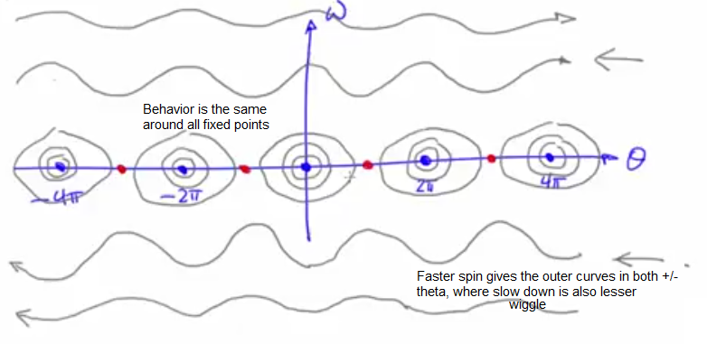
  - With no friction, there is no attractor, because there is nothing to cause the transient to die out. The elliptic fixed points in the above image are **NOT ATTRACTIVE** for this reason.
  - A system without friction is called a conservative or hamiltonian system
  - The trajectories demonstrate uniqueness i.e they do not cross and this is a mathematical requirement

### ODE and Dynamical system

- Derivative (slope of x(t), ODE) w.r.t time for dynamical systems. To find the solution we would also need the constant (or x(t) at t=0)
- Any ODE that can be solved analytically on paper is clsoed form by definition not chaotic
- Nonlinearity is a necessary condition for chaos. If an ODE is non linear it is possible there is no analytical solution
- If there is no analytic solution to an ODE, then the ODE is for sure chaotic
- x' = sinx is a nonlinear ODE
- Why ODE?
  - Good models that capture biology, physics, enonomics etc.
- Non linear equation have powers, products of variables or transcedentals (such as sin x)

### Fixed points and stability

- A point in the dynamical system that is stable under the influence of dynamics
- Stable fixed point -> Perturbation shrinks, Unstable fixed point -> Perturbation grows
- Dissipative systems have attractors
- Conservative systems have no friction and hence no attractors. There are still fixed points and chaos though, just that there are no fixed/chaotic attractors.
  - Solar system is a conservative system on human scale. But Pluto's orbit is chaotic.
- Initial condition outside the basin of attraction of a fixed point will not lead to convergence. Think off dynamics as an oddly shaped bowl (the shape defined by the dynamics), where the bottom most point is the fixed point. A trajectory is a ball rolling on the topography/landscape (intuitive shape of the state space) defined by the dynamic. This analogy is useful for 2-D state space.

### Saddle points and Eigen vectors

- Fixed points can either be on a dynamic landscape of:
  - An inverted bowl
  - Saddle (eg. inverted point on a pendulum)
- Matrices affect transformations of space
  - Define computer graphics, the connection goes to the landscape in dynamical systems
  - Eigen means same
    - Eigenvalues:Tells how fast the state travels along the eigenvector and it's direction. Movement along an eigen vector: $e^{s_it}$
      - Imagine a ball rolling from a mountain along a stream. EV at the top would be positive as ball travels away and EV is negative at bottom where ball travels towards. The distance between the ball drop in the stream and the place where we drop it grows exponentially
    - Eigenvectors: A point that starts on an eigenvector stays on the EV. (think of a ball rolling on a landscape)
    - To find EigenValues subtract s from the diagonal elements and calculated the determinate (to get the roots of the characteristic polynomial). Each value has it's own eigen vector. Possibilities (each of these indicate a type of fixed point discussed earlier):
      - e^s shrinks. Both point inwards like a bowl 
        - If s1 & s2 are perpendicular they are a hemispherical bowl
      - Upside down bowl 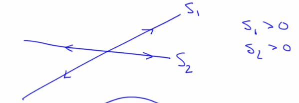
      - Saddle 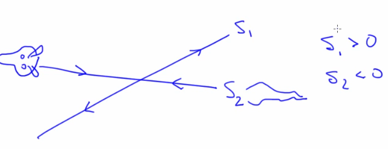
        - For a pendulum, saddle points are at odd values of theta
        - Eigen values/vectors work when we are looking at a small patch of the system 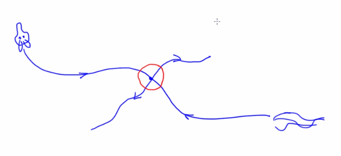
        - NonLinear Systems occuring in nature do not have bowl/saddle shapes as they are much more complex and nonlinear.

### Stable and Unstable Manifolds of Fixed points

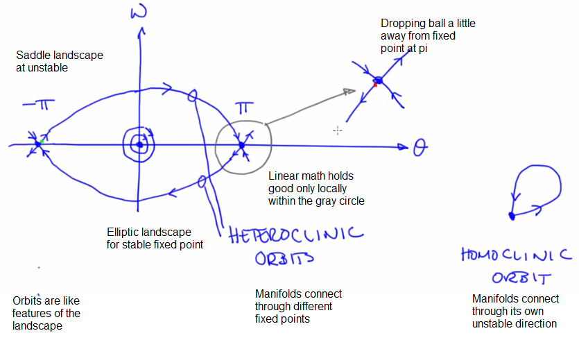

- Manifolds are surfaces in the state space that are like non-linear generalizations of eigen vectors. They are invariant manifolds i.e state that starts on this manifold stays on that manifold just like an eigen vector
  - Manifolds are useful in determining boundaries of basins of attraction, filtering out noise and controlling chaos
  - 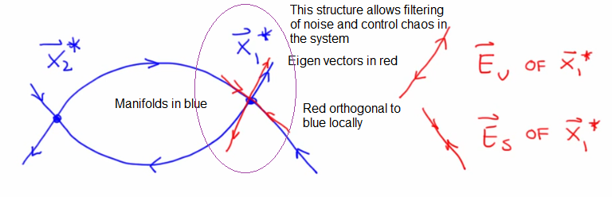
  - The entire structure above also is usefully in formally proving that a system is chaotic
  - The bends and folds in the manifolds are the source of i) sensitive dependence to initial conditions ii) structure of a chaotic attractor
- Things spread along unstable manifolds and converge along stable manifolds
- Stable manifolds (bowl, converging) - Set of initial conditions such that x->x* as t-> inf
- Unstable manifolds (Upside down bowl,diverging) - Set of initial conditions such that x->x* as t-> -inf while staying on the manifold

### Attractors

- Four kinds of attractors in dissipative nld sytems:
  - Fixed points 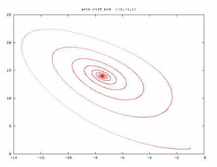
  - Periodic Orbit/ Limit cycle 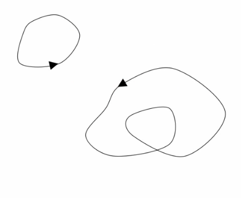
  - Chaotic/Strange attractors. Exponential divergence of neighboring trajectories is sensitive dependence to initial conditions 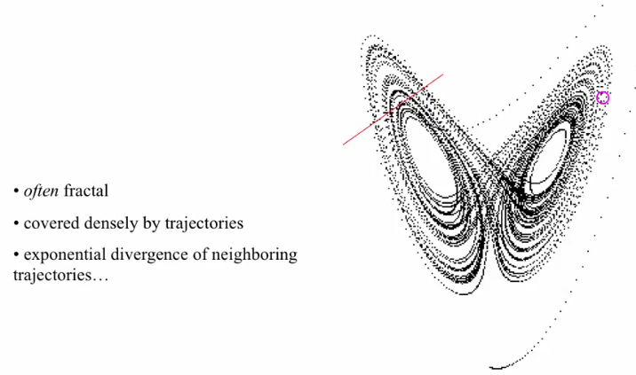
  - Quasi-Periodic orbitic
- A nonlinear system can have any number of attractors, of all types, sprinkled around the state space. Their basins of attraction partition the state space. There's no way to know where they are, how many there are, what types etc.
- In determininstic dynamical systems and intersection cannot occur in the state space or the orbit because at the intersection there would be two paths for the trajectory which is a violation of determinism

### ODEs, Vector fields and Dynamical landscapes

- Transformation to convert higher order ODE's to n first order ODEs . Nth order ODE needs n-1 helper variables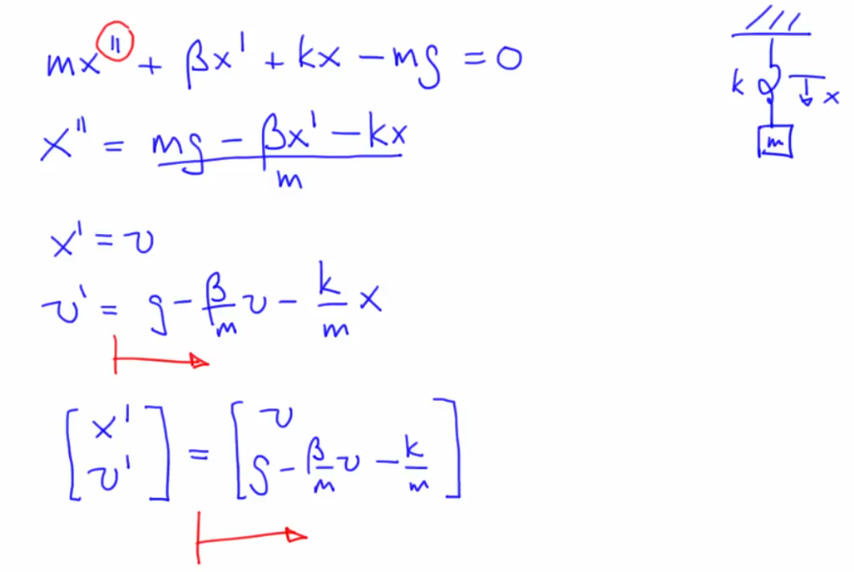 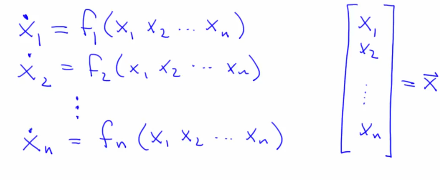. Each of the n vectors in this representation is a vector field that gives the slope
  - Derivates on the LHS, RHS only captures dynamics of the system i.e how things change based on values of state variables and parameters
  - Vectors are thin matrices, single col/row
  - Elements of the above vector are the two state variables (position x, velocity v) of SHO. State vector contains state variables
  - **The number of state variables, height of the state vector, the number of axes in the state space, order of the original ODE is all the same (2 here).**
  - 2-D cannot be chaotic. 3 dimensions is a necessary condition for chaos in continuous time systems
  - Time independent representation 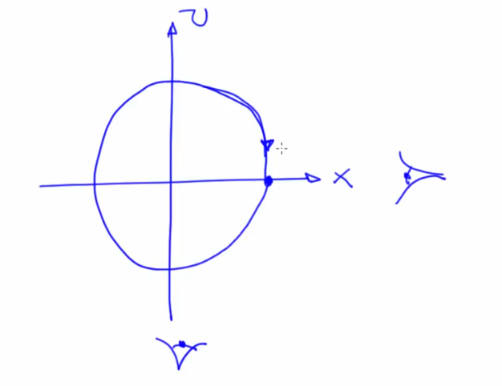
  - Think of a ball placed as a way to visualize the development of trajectories in state space but not in the physical sense
  - The derivative vector field (i.e the slope) at every point is tangent to the solution
- Matrices capture how a ball rolls on a dynamical landscape. The statement is completely true everywhere if the landscape is defined by a linear ODE (like a bowl/saddle). The matrix is only good locally if the system in nonlinear.
- If the system is nonlinear we can't write the ODE in matrix form i.e we can't write $\dot{\vec{x}}=A \vec{x}$ with only numbers for A (since they have products, transcendentals etc). But we can linearize non-linear ODEs using **Partial Derivatives and Jacobian matrix**.
- Jacobian matrix is a local linear approximation of a non-linear landscape and it's eigen values/vectors tell what kind of linear landscape (bowl/saddle) is a good fit

### Numerical ODE Solvers

- An ODE tells for every point in the state space what the derivate is i.e in which direction will the trajectory/state evolves
- 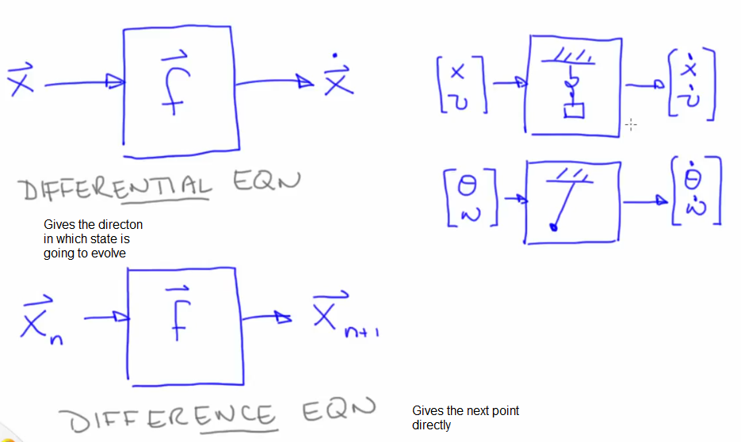
- The differential equation only gives the direction in which state is going to evolve but not the next point unlike a difference equation. This requires additional work done by the ODE solver.
- Numeric solvers take as input the ODE, initial condition and time step (del T) and gives an estimate of the state at $\vec{X} (t_0 + \Delta t)$ 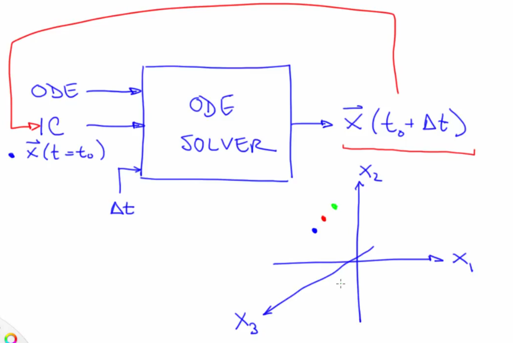

### Two simple ODE solvers: forward and backward Euler

- To figure out what direction is downhill, do a vector sum of x' and v' (i.e the state variable derivatives) 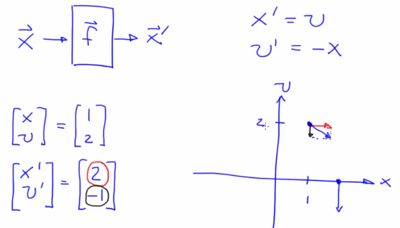
- Forward Euler (Spirals out): "Follow the Slope".
  - Effort vs Accuracy tradeoff on how far down the slope
  - Computed as: $ \vec{x}(t_0 + \Delta t) = \vec{x}(t_0) + \Delta t \cdot \vec{x'} (t) $
- Backward Euler (Spirals in)
  - $\vec{x}\left(t_{0}+\Delta t\right)=\vec{x}\left(t_{0}\right)+\Delta t \cdot \vec{x}_{FE}^{\prime}\left(t_{0}+\Delta t\right)$
  - $\vec{x}_{FE}^{\prime}$ is not the derivative of the original point but the derivative at the point where we get to if we take one step using forward Euler
  - This is useful when the direction pointed by FE is at an offset compared to actual path.

### Solving ODE's of a SHO

- v/x are circles (ideal solutions for non-dissipative systems) but these are sines and cosines in the time domain
- Each Forward Euler solution point turns as a spiral around the circle
- Time step exacerbates the error
- 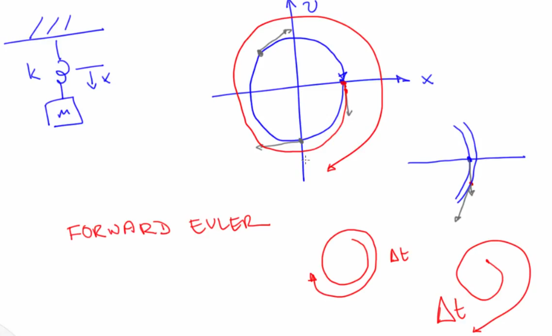
- Backward euler replicates the direction of the next step (one after FE) at the original point 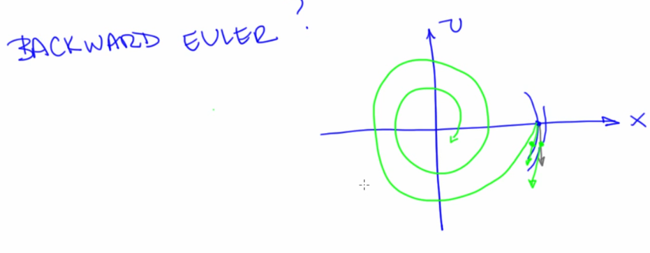
- Backward Euler produces the exact solution for a dampened SHO due to numerical damping 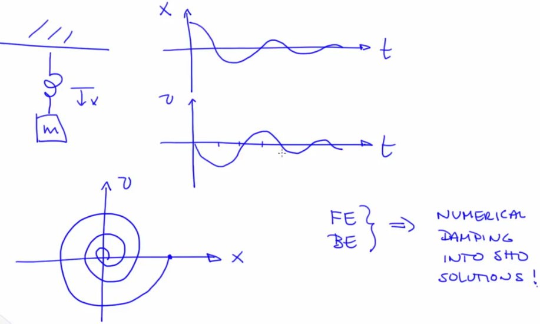
- FE produces negative damping (more like a push), BE produces positive damping
- FE and BE are not used in practice but are useful in understanding how ODE solvers work and how they break

### ODE Solvers: Error and Adaptation

- Forward Euler overshoots because of the Taylor series (approximation at a point) 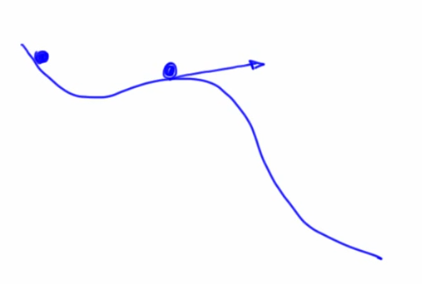
- 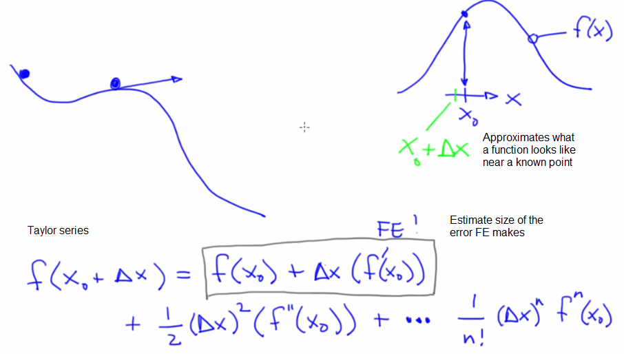
- The local truncation error of FE is not proportional to the step size (square of it) and it is dependent on the dynamical landscape
- Types of errors:
  - Truncation error: From terms in the series that you didn't use
  - Roundoff error: From the digits that the computer cut off. Errors snowball due to wrong value getting to the next step
  - Observational error: Inserted between the system and the observer
  - Dynamical Error: Coupled back into the system (Dangerorous as it can snowball)
- Local truncation error for FE (for a single step). $O (\Delta x^2)$ or O($h^2$) error: $\frac{1}{2} \Delta x^{2} f^{\prime \prime}\left(x_{0}\right)$
- BE also has a $O (\Delta x^2)$ or O($h^2$) error
- The average of these errors and then use combined slope of both methods to move forwards. Trapezoidal method with error h^3 which is lesser than h^2 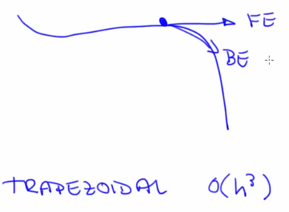.
- Geometry of landscape determines step size. Adaptive time step ODE solvers 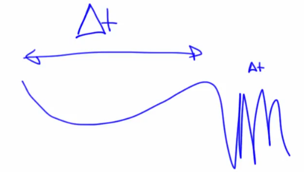
- 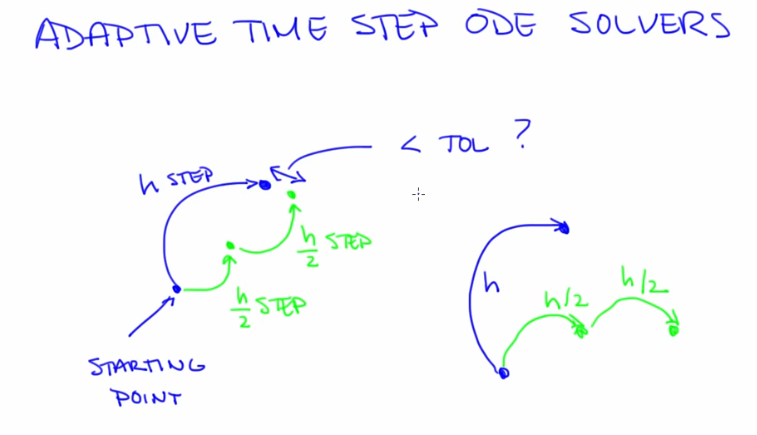
- Pseudocode. The tolerance is important to be carefully chosen to avoid numerical effects 
  - 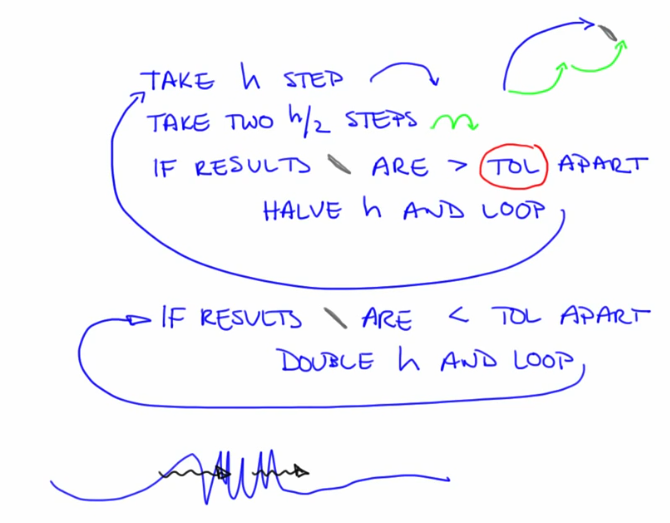

### Production ODE solvers

- Runge Kutta method (Test steps to understand landscape). Order of RK is the number of test steps
- RK4 is commonly used
- Single step ODE solvers use only info available in a single point to go forward: FE-RK1, BE-RK2
- Multi-step ODE solvers use a bunch of points:
  - Determine points down the solve
  - Fit a function to this slope
  - Integrate the function to get the actual

### Numerical dynamics and due diligence while picking ODE solvers

- Causes of errors in ODE solvers:
  - Time step
  - Geometry of landscape by f(x) [Absent in linear systems]
  - Computation effects. Machine epsilon is the smallest width between two numbers on a number line. Smallest fraction of a number a computer can handle. But representations like IEEE Floating Point allow varying epsilon 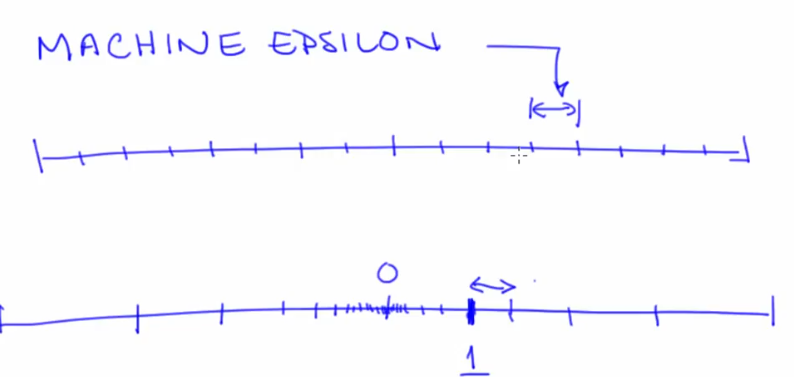

- These errors can:
  - Cause distortions, bifurcations etc
  - Look like real physical dynamics
  - Source is varied (algorithms, arithmetic system, timestep)
- What could you do to diagnose spurious numerical dynamics (when using solvers from numpy,matlab etc. for eg)?
  - Change the timestep
  - Change the method
  - Change the arithmetic
  - But beware of machine $\epsilon$
  - If results dont' change by changing above then they are probably right
- Thickening of curve between a 500 and 5000 point SHO trajectory due to "Numerical error is violating the conservation of energy property of a SHO with β = 0; since this system is a conservative system a symplectic integrator should be used."
  - 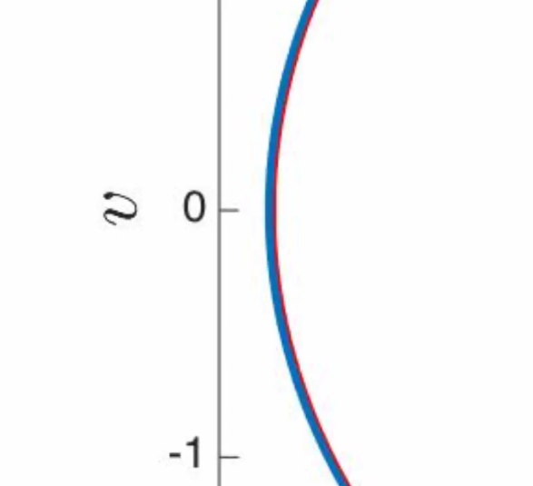

### Shadowing and Chaos

- Chaotic systems are sensitively dependent on small changes in state
- The ODE solvers inherently introduce small changes due to errors. How can we infer that the trajectory is the actual trajectory of a chaotic system?
- **Shadowing Lemma** (only applies to chaotic attractors, **ONLY for STATE vectors and not parameters**) - Every noise-added trajectory on a chaotic attractor is shadowed by a true trajectory. Given, the noise does not bump trajectory out of the basin. This is for state noise and NOT parameter noise.
  - ODE solvers produce points on the attractor but maybe not in the right order because at every step it gets bounced around due to error but the lemma saves us. With a reasonable solver, these effects happen on a tiny scale
  - Highly magnified version of trajectories not noticeable at level of vision 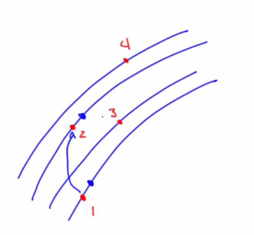
- For a fixed point attractor, perturbation will shrink naturally
- Numerical errors in period cycle present 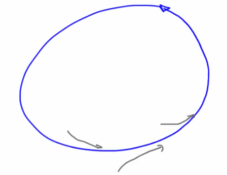 but the difference will shrink because of the contraction of state space of the transverse stable manifold that slopes downhill towards the limit cycles (like the curve in a hat)

### Solving ODE's numerically, Review

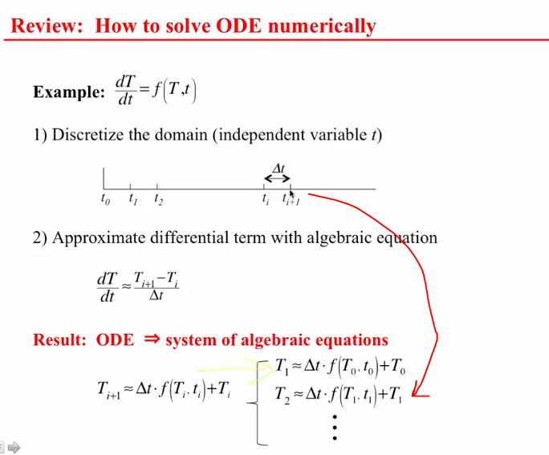

PDE's have more than one independent variable. PDE's are specially useful with fluid transfer

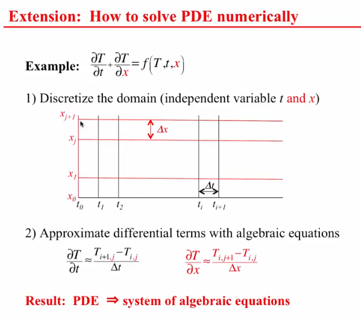

### Dynamics and State space deformation

- Smale's horseshoe, takes close points far apart and far points close to each other 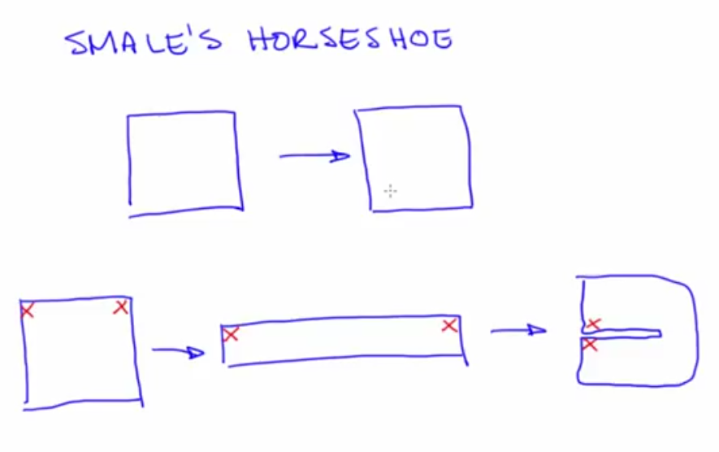. A formal observation for chaos
- Dissipation happens when state space shrinks
- 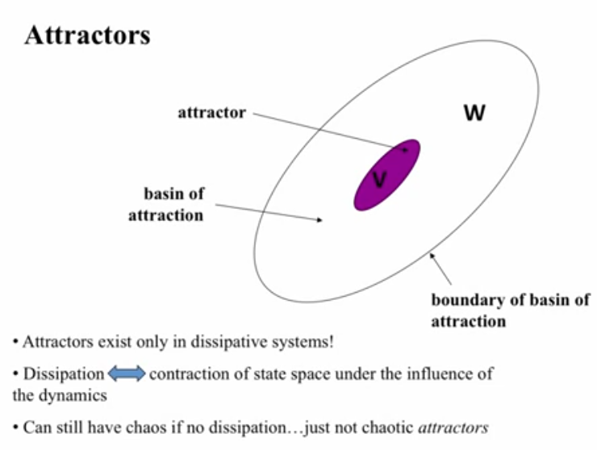

### Lyapunov exponents

- Just like an eigen value is associated with each eigen vector, a lyapunov exponent is associated with each un/stable manifold. Growth along those manifolds grows as e^(lyapunov exponent*t)
- Lyapunov exponents (two sets local and global (t->$ \infty $)):
  - $n$ -dim system has $n \lambda_{\mathrm{i}}$
  - negative $\lambda_{i}$ compress state space along stable manifolds
  - positive $\lambda_{i}$ stretch it along unstable manifolds
- If all $ \lambda $ are negative, dynamics is shrinking the fabric of state space in all directions and all trajectories converge to a fixed point
- If all $ \lambda $ are positive, dynamics is stretching the fabric of state space in all directions and all trajectories converge to a fixed point
- To get an attractor, shrinking has to win in the longterm i.e $\Sigma \lambda_{\mathrm{i}}<0$ for dissipative systems. Positive lambda is a signature of chaos (a necessary condition)
- Trajectories that are not on any manifold feel a mix of the effects of stable and unstable manifolds but because of exponential nature, the largest (numeric value denoted as lambda1) lambda wins in the long term
- These exponents capture how fast things shrink or grow in every region of a chaotic attractor
- Since positive exponent is a characteristic of a chaotic system and a negative exponent a char of dissipative (attractor), for a chaotic attractor we need atleast one positive and one negative 

### Sections and Projections

- Strategies for reducing dimension of state spaces to understand while still preserving meaning of the object working with
- Projections
  - 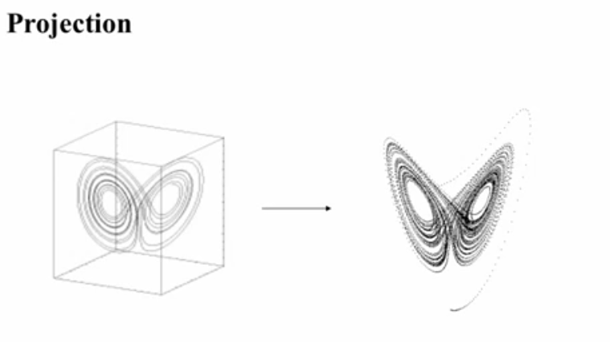
  - Creates things like crossing, that are illegal in dynamics and can be confusing
  - In mathematics, repeated projections more than once it does not change things beyond the first time
  - Time series are a projection
- Sections
  - They are like a CAT scan, they take slices of an object.
  - Generally, sections are one dimension less than the object
  - Usually called Poincare section gives very good illustration of the structure
  - Points on a plane of section (sections through space) exist only where the trajectory pierces the plane 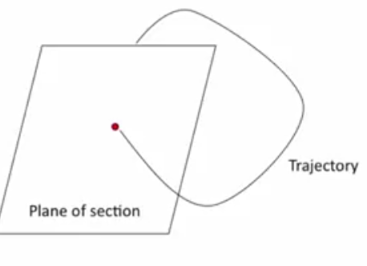
  - Sections through time. Shining light only at specific instances. This discretizes time,turning flows to maps
  - Highlights topological changes in the attractor

### Unstable periodic orbits

- Unstable periodic orbit: Imagine a ball rolling on the brim of a volcano
- Stable periodic orbit: Ball in the curve of a hat
- Eigen value associated with the transverse unstable direction determines the tendency to fall off. Bigger in case a of a cup rather than a doughnut 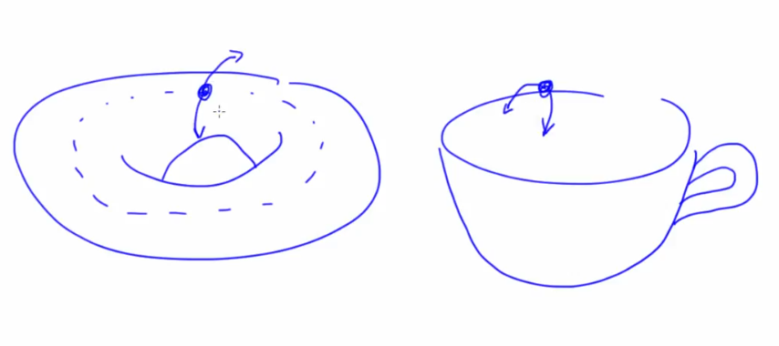
- There are infinite number of unstable periodic orbits embedded in chaotic attractors 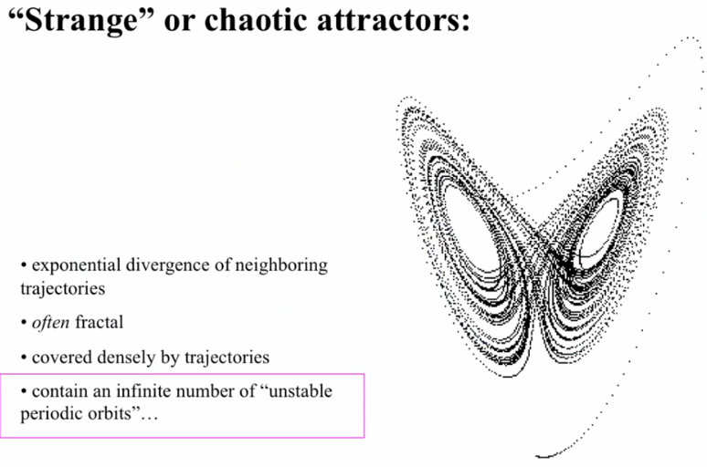
  - Exponential divergence of neighboring trajectories
  - Often fractal
  - Covered densely by trajectories
- 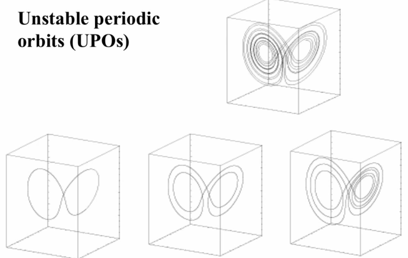
  - The UPO's have different periods
  - The third image, goes around each side of the attractor an unequal number of times (3 of left, 5 on right). Imagine attractors being at the centre of the basin of attraction.
  - There are a number of trajectories even within a small distance from the current one. Any trajectory in the basin will eventually visit any unstable periodic we choose, when it visits one it may traverse more times for a doughnut like structure than a cup. The trajectory will eventually fall off the UPO because it was not on it but only near it.

### Fractals and Chaos

- Fractals are non-integer fraction dimension
- Cantor set visualization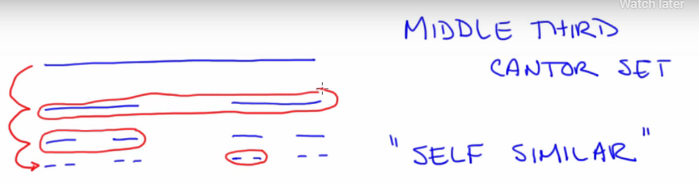
- Cantor set calculation: The epsilon here is the fractal dimension 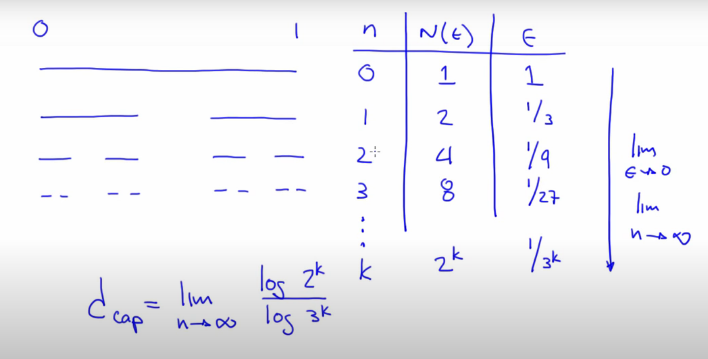
- Capacity dimension 
- Norm is a form of measurement. The cantor set uses euclidean norm 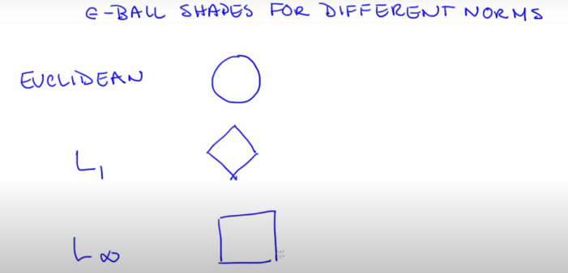
- Cantor set from lorenz attractor 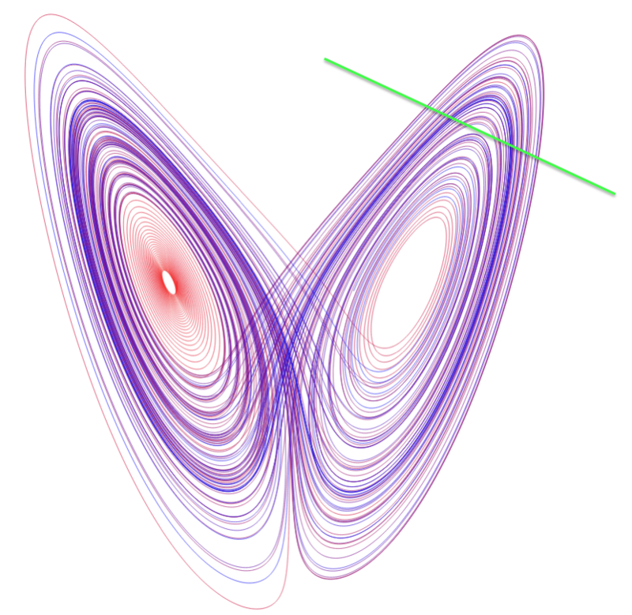
- Most chaotic systems but not all have fractal space structure

## Nonlinear time-series analysis

### Time-series analysis and the observer problem

- Spectral analysis tools like FFT's allows frequency analysis of time series plots
  - Separates signal component into it's building blocks
  - Superposition of fft gives the signal. The requirement for this is for the system to be periodic, linear. Problematic if signal is non-stationary
- Spectrogram: Frequency vs time

- In NLD, we may not know all state variables and measuring them may affect the dynamics of the system. In reality, we would have a function of the state variables 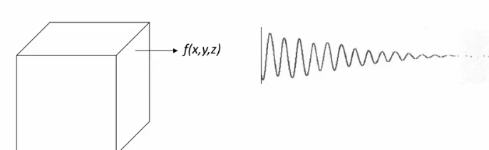
- In the kinds of systems (dissipative) covered in this course, there can be only one downhill direction at any point in state space. This may not be true in non-autonomous systems the dynamics change with landscape.
- Projections should not cross trajectories
- Such projections would lead to sensor altering the fundamental shape of the object
- **Observer Problem** : To deduce the internal state of the system and their values from the outputs of the system. Eg: Trying to find internal states of a traffic light by looking at the colours. This involves undoing a projection 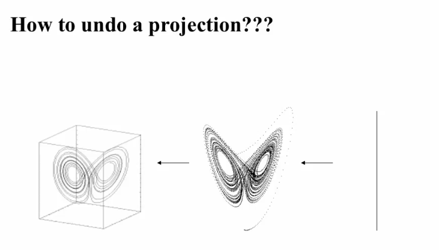

### Delay - coordinate embedding

- A single measurement in time of a system, projects the state space down in a single axis
  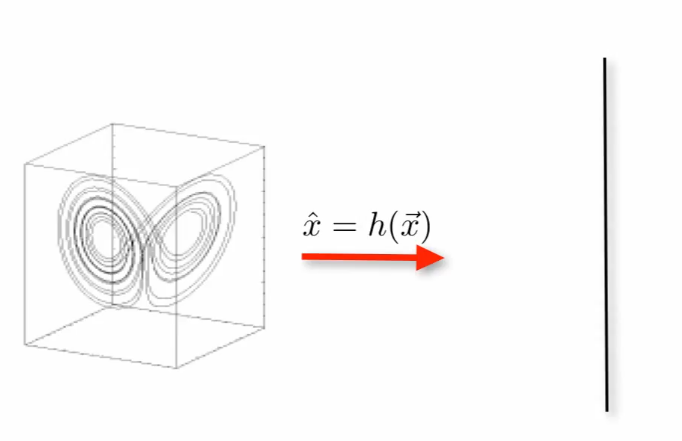
- How do we go back from the single axis to the projection?
  - Problems with doing it:
    - Derivatives magnify noise. 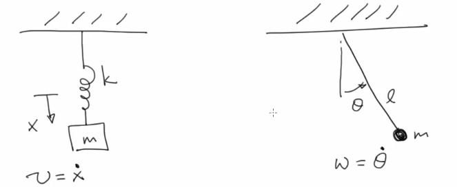 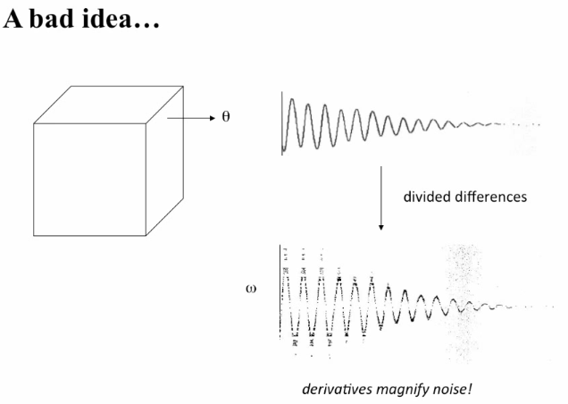
    - Not having measured all state variables
  - To solve above, we have a technique called delay-coordinate embedding - Reinflate the squashed data to get a qualitatively identical (next segment) copy of original.
    - It's like running a comb through the data, with number of comb equal to the number of axes separated by a delay. ($ \tau $). m is the embedding dimension 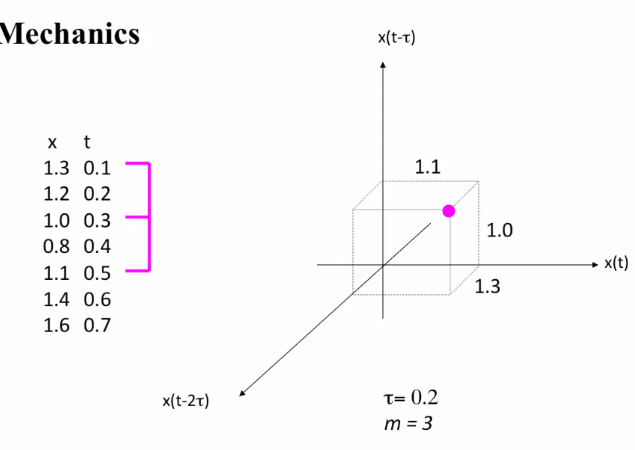
    - Example:
      - Step 1 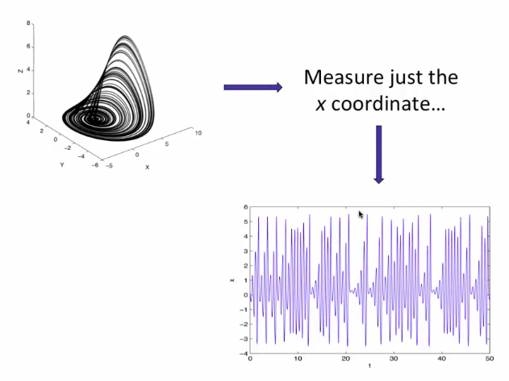
      - Step 2 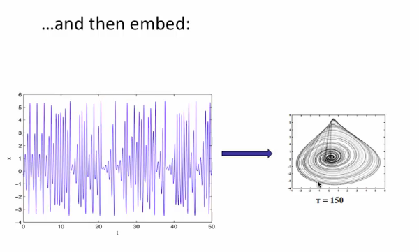
      - Choosing the right m & $ \tau $ is necessary to get a transformation like this
- **Takens theorem**: For the right **$\tau$** and **enough dimensions**, the embedded dynamics are diffeomorphic to (have same topology as the original state-space dynamics. 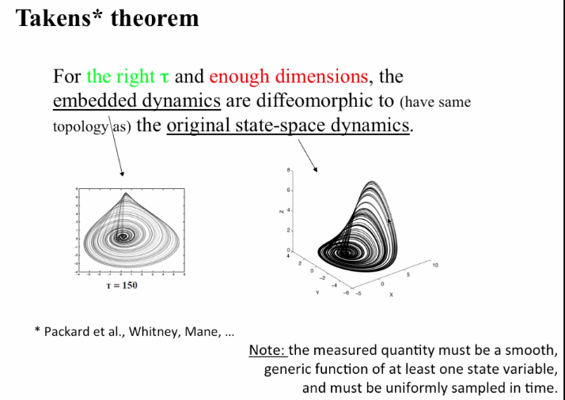
  - Effects of $\tau$ on reconstructed dynamics:
    - If $\tau$ was 0, all the teeth of the comb would be pointing to the same number
      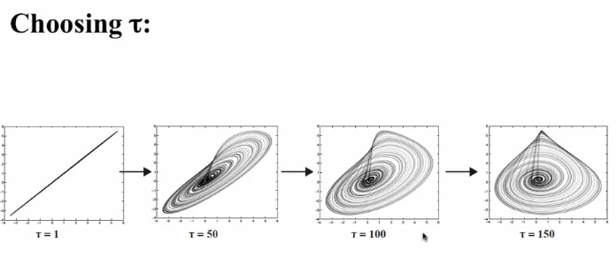
    - Machine epsilon should be able to handle the $\tau$ values
    - Tau should be large enough to capture all features. Also, note that tau should not be equal to the period as it would result in the same point
    - The embedding and true dynamics can look different when tau gets really large
- To get the topology right using delay coordinate embedding we need to get enough axes (eg. you can't get the topology of climate in a place just by recording a thermometer). Atleast twice as many comb teeth as there are state variables in the system 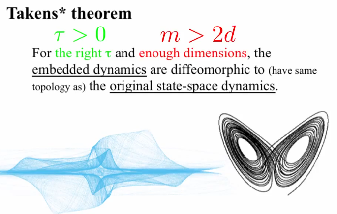
  - However, this is an overly pessimistic condition since it is not possible to know all the state variables. 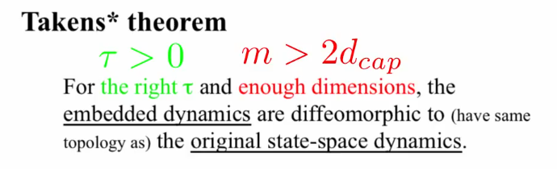. Chicken and egg problem because we have to embed data before we calculate $d_cap$
  - For the measuring function in Takens theorem, we need not know what it is measuring, we just want to know it is smooth and uniformly sampled (it need not be continuous)
- It is useful to embed scalar time-series data before building a prediction model of a deterministic dynamical system because:
  - It exposes the temporal patterns in spatial form.
  - If you don't do that, the false crossings created by the projection involved in the measurement can make your predictions wrong.

### Topology, diffeomorphisms, and reconstruction of dynamics

- Good data and good method (tau,m) is required for Takens theorem.
- Geometry is measureable (metric) but topology is not. Only number of pieces/holes matter in topology.
  - Similar topology different geometry
    
  - Similar geometry different topology
    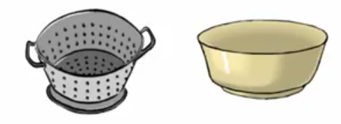
- Diffeomorphism
  - Think of a coffee mug and doughnut made of clay. We can deform to match geometry without breaking topology (new pieces/holes)
  - Mapping from one to the other is differentiable and has a differentiable inverse. What that means:
    - qualitatively the same shape
    - have the same dynamical invariants (eg. $\lambda$)
  - A correct embedding is related to the true dynamics by such a transformation if the conditions of the Takens theorem are met
  - The real vs reconstructed attractors don't look alike to us because our eyes respond to geometry not topology
  - Topology really matters, many of the important properties of dynamical systems such as $\lambda$ are invariant under such transformations (diffeomorphisms that preserve topology).
    - This means we can measure one thing from a very complicated system, do the embedding, compute the value of a dynamical invariant like $\lambda$ and assert that this holds for the true dynamics in the system
  - For delay-coordinate embedding to work, we only need to measure a smooth generic transformation of atleast one state variable. We do not need to have direct, untransformed measurements of a single state variable. In case of Lorenz's attractor we measure x*y-z transformation of all state variable and DCE worked fine

### Estimating Embedding Parameters

#### Choosing the right $\tau$

- As $\tau$ gets larger there is the problem of overfolding due to numeric effects. Determining which of the value results in the closest to the true dynamic is a challenge
- Identifying the first time where the dynamics was unfolded is a challenge. To understand this better,(only for the sake of understanding aid) consider the linear system example of basis vectors
  - 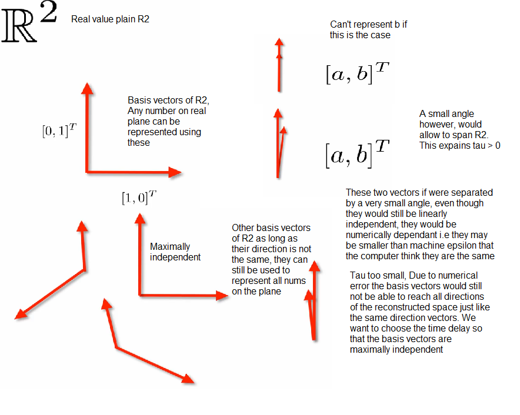
  - In linear dynamics, we may be able to use autocorrelation to determine the first zero to find tau of linear independence
  - But in NLD, the autocorrelation function would ignore the non linear correlations that occur between the two basis vectors.
  - Problem with the first zero is that after a 2$\pi$ transformation it wraps on itself leading to the overfolding problem which may lead to numerical error in the nonlinear case
    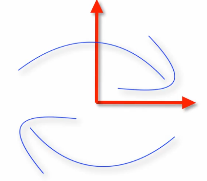
  - Choose $\tau$ such that the basis vectors are as independent as possible while not wrapping the system around on itself
  - Mutual information should be less i.e each coordinate sharing the least amount of information with the other. The small angle tau arrows share more info that the right angle tau arrows for example.
  - Coordinates in the delay vector should have the least amount of shared information. Some heuristics for estimating $\tau$. The method of selecting $\tau$ is highly application-specific 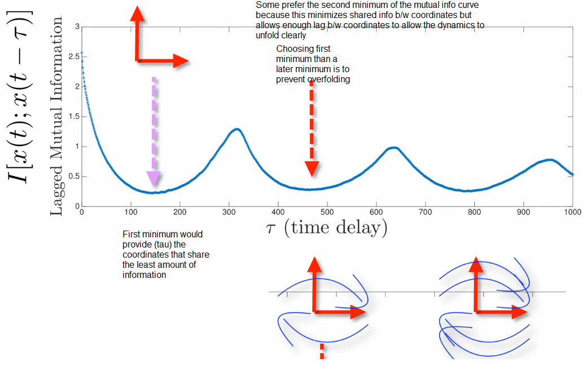

#### Choosing the right m (Embedding dimension)

- Heuristic method of false neighbours
  - If there are not enough dimensions for the attractor to unfold, there will be crossings in the dynamics (something which is not allowed in dynamic) and is an error in projection
  - False neighbours, neighbours in one dimension but not neighbours in a higher dimension. The fraction of false neighbours needs to be low
  - Dimension of the original system cannot be determined from the m obtained using this method because it's merely a heuristic and not an actual proof

### Caveats and Extensions

- Delay cooridnate embedding is a good technique because it let's us reconstruct unmeasured information
  - The reason this works is the standard form of the ODE. The change in each state varibale is a function of the other state variables. First order forward differences 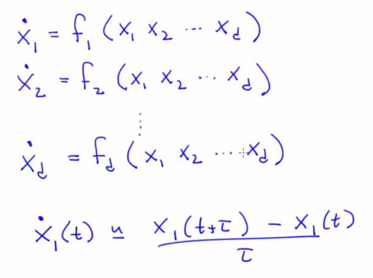
- Real life challenges in chaotic systems. Takens theorem requires:
  - An infinite amount of **noise**-free data measured by a smooth measurement function on state space.
    - If the false neighbour ratio flattens out at a higher than required threshold, suspect noise 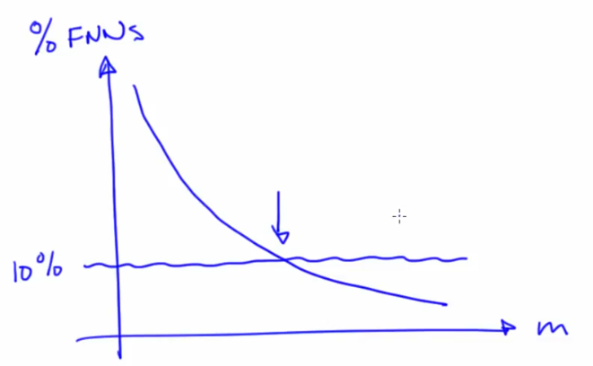
    - Noise increases with embedding dimension
  - Sampling: Uniformly sampled in time and sampled quickly enough to capture all the important dynamics. (Nyquist rate only holds good for linear systems). Chaotic signals have meaningful content at all frequencies, they are broadband. Chaotic (also, veils in logistic map): 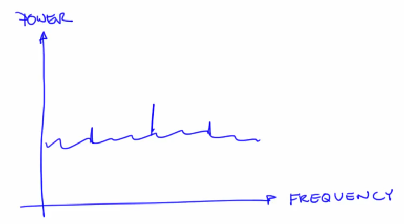
  - Stationarity: Dynamics should not change while measuring. The large enough data set required to construct dynamics means multiple switching dynamics maybe involved in that time space

#### Due diligence required in Non Linear Time Series Analysis

- Double check your estimates of the embedding parameters by calculating dynamical invariants from the embeddings, then varying $m$ and $\tau$ and seeing if their values change
- Downsample your data and repeat the analysis
- Chunk up your data and repeat the analysis on the different chunks
- Know the limitations (e.g., sampling rate, data length)
- Do not extend your conclusions beyond what's justified by those limitations
- Keep an informed eye open for noise effects

### Computing Fractal Dimensions

#### Capacity Dimension

$N(\epsilon)=\frac{k=1}{\epsilon^{d_{cap}}}$

$\log (N(\epsilon))=d_{cap} \log (1 / \epsilon)$

Slope of this give the capacity dimension given by the above formula 

$d_{cap} \equiv \lim _{\epsilon \rightarrow 0^{+}} \frac{\log (N(\epsilon))}{\log (1 / \epsilon)}$

- $\epsilon$ - Size of the circle/side of square
- Capacity dimension also known as box dimension is covering with shapes of size epsilon. Determining how many boxes for each epsilon.
 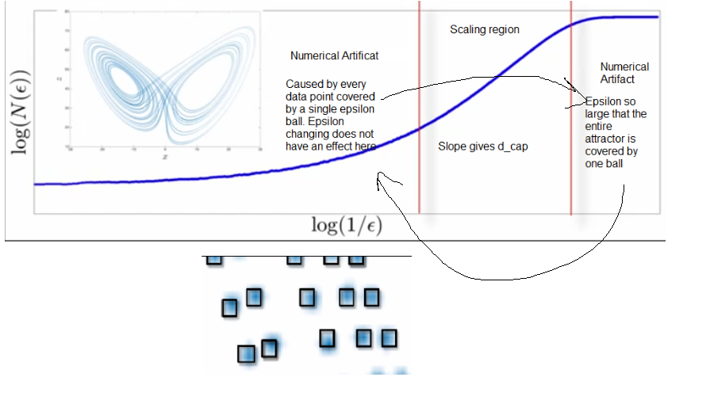

- Calculate number of epsilon balls required for each size and fit a line through these points to get the $d_cap$
  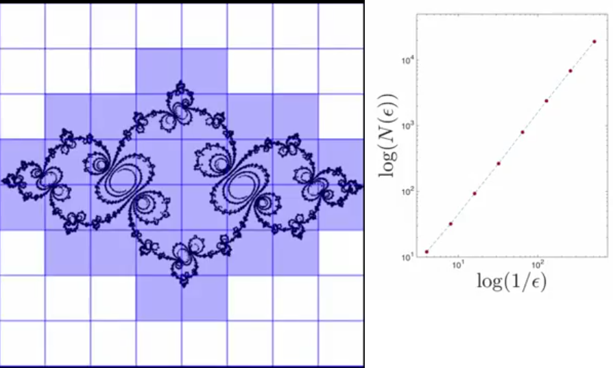
- This is useful in finding capacity dimension of natural opbjects 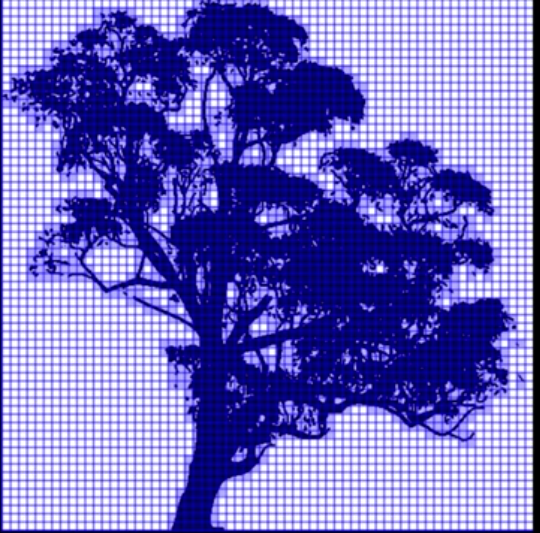

- If you start from Time Series, use DCE to get the projection and then apply the steps to find number of squares of each size (reduce the size of the ball to the least possible as lim $\epsilon \rightarrow 0$) to get the slope and capacity dimension

#### Correlation dimension

- To reduce the computational expensense of lim $\epsilon \rightarrow 0$)
- Start by defining pointwise dimension
- Pick a point on the trajectory
- Draw a ball of radius epsion centered on that point
- Count the number of points and the number of points within the epilon of that point
- Vary Epsilon. Average this over different X
- 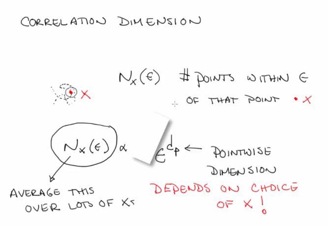
- The number of X's (sea of epsilon) 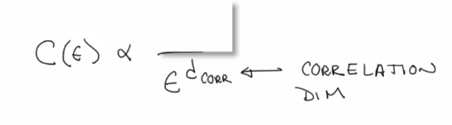 $d_{corr} <=d_{capacity} $

- Very fast algorithm compared to capacity dimension calculation 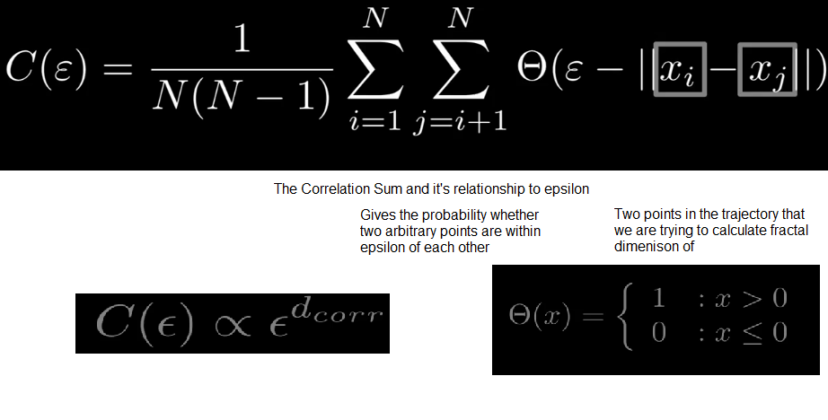

- Capacity dimension measures the number of boxes needed to cover the points in a set, whereas correlation dimension measures the clustering of those points.

### Computing Lyapunov exponents

- Exponent that parametrizes the exponential growth of the separation between two points on the chaotic attractor as time goes forward
- Chaotic: Atleast one positive lamda
- Dissipative: Some are negative lamda
- They are dynamical invariants, i.e we can take an attractor and deform it and bend it and as long as we don't change the topology, the exponent will be preserved

- DCE of time series data to reconstruct topology
- Operationalize this 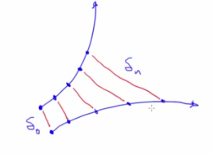

#### Wolf's method

- Choose a point on the trajectory of a dynamical system
- Look for the point's nearest neighbour
- Track the distance between those points
- Notice renormalization at the end point of one set of points i.e x(t1) 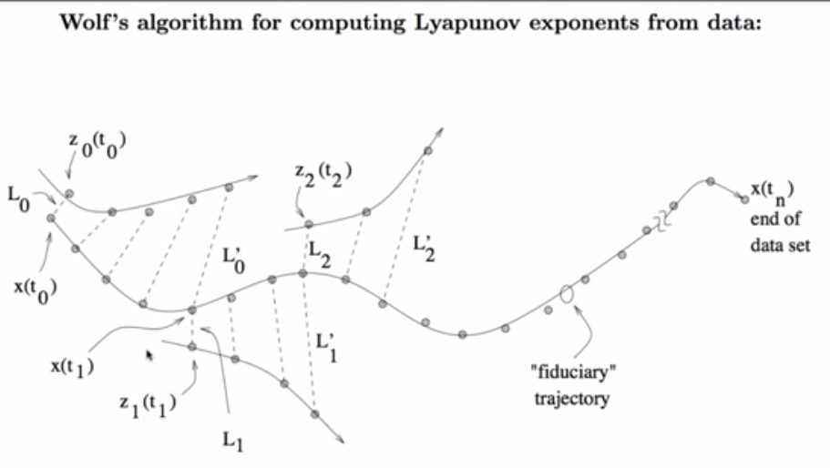

Assumption: The two chosen points are on the same trajectory separated by time. This applies to autonomous systems (always in downward slope irrespective of time) (non autonomous sytems can have trajectory points that go in different directions at different times)

#### Kantz method

Noise in data is bad as it's reliant on a single point

- Choose a point on the trajectory of a dynamical system
- Draw an epsilon ball around it 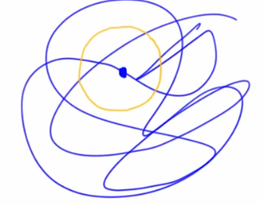
- Find all the points inside the ball
- Measure distances from central point
- Average all distances
- Compute one step forward point (green) of all the chosen points 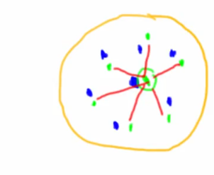. Find distances again.
- The ratio of average of distance1 to distance2 is a measure of stretching factor (Lyapunov exponent) of the state space

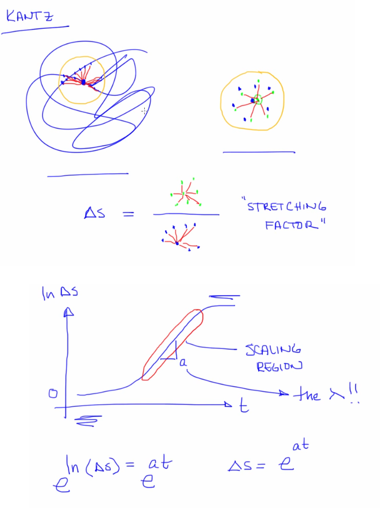

Assumption: All points are in the same trajectory

### Noise & Filtering

- Low pass filter allows only low frequency components. Linear filtering in a bad idea if system is chaotic as it is hard to distinguish signal from noise
- Non linear alternatives:
  - Geometry of stable and unstable manifolds
    - Overlapping forward and backward states to reduce the size of noise 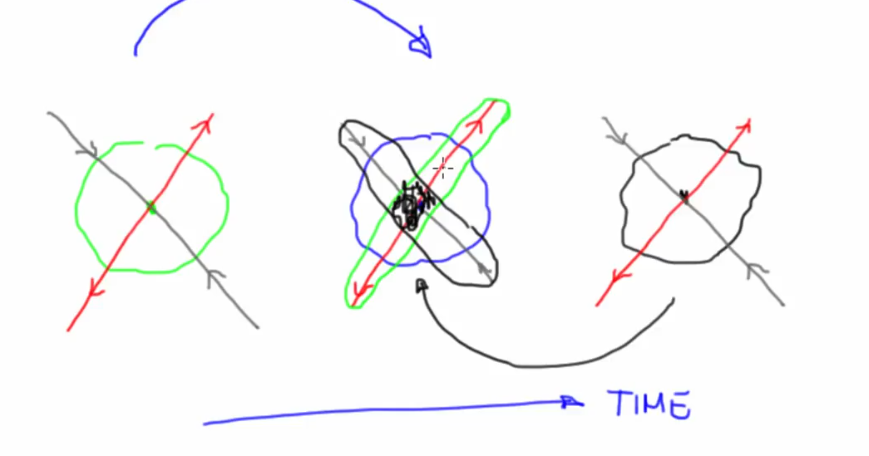
    - 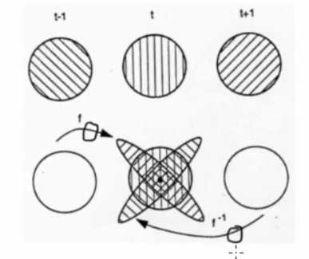
    - 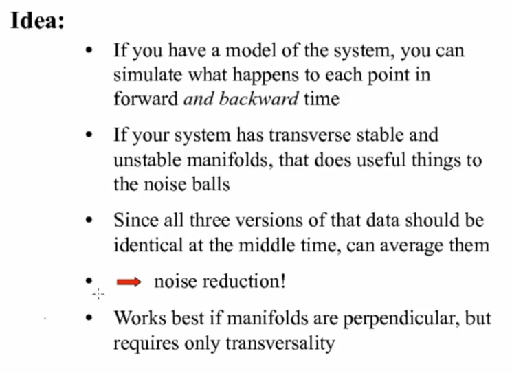
    - 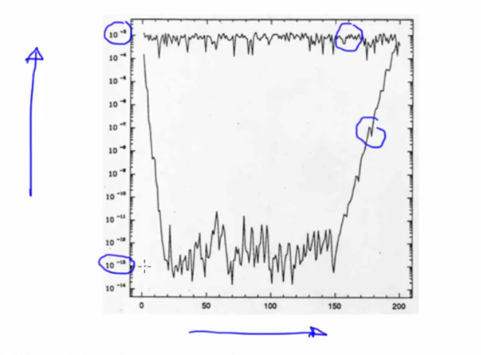
  - Topological properties
    - Isolated points are usually noise
    - 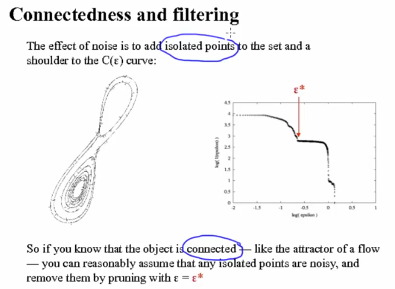
    - 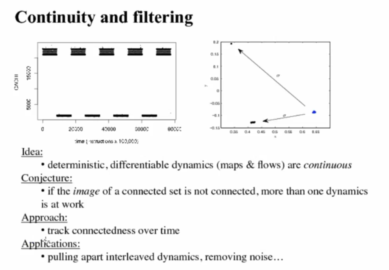

## Applications

### Prediction

- Machine learning can be used (although not directly) in Non Linear Dynamics
- Lorenz's method of analogues
  - Nearest neighbour in a dataset to predict behavior. Map closest matching parameters in data set and find it's next step
  - k nearest neighbours makes this immune to noise
  - 

### Control

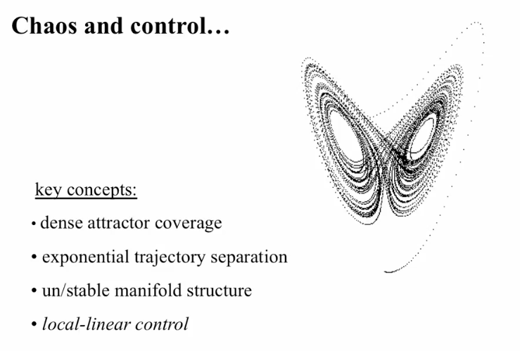

- Saddle points in nonlinear systems only looks like this locally, if we backed up the manifolds woulve be curves
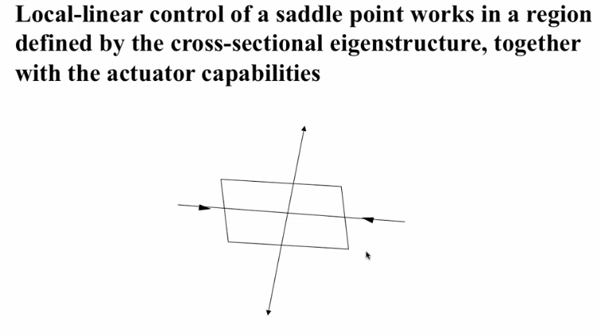
- Control in State Space

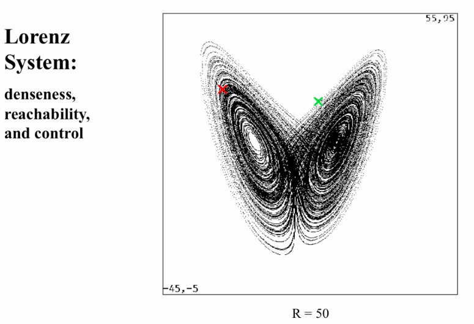
- Find a parameter value such that there exists a chaotic attractor with one thread close to the destination point.
- Control Strategy amounts to tune the parameter to that setting and wait
- The denseness will ensure that the trajectory eventually reaches
- To stop, find an unstable periodic orbit near the destination. Then stabilize the system using local linear control. We use that UPO to balance the stable and unstable manifold like a saddle

#### OGY Control

- Reachability (get near destination): Dense Attractor Coverage
- Controllability: Un/Stable manifold structure + UPO (embedded in the attractor) denseness (find one UPO near destination) + local-linear control (stay on UPO once nearby, rectangle in previous image)
- OGY control cannot be used to stabilize a chaotic system at any point in its state space. Local linear control only.
- OGY control is not for time critical applcations because we don't know how long it will take to the destination trajectory
 
  - One way to workaround this is by using sensitive dependence (targeting to get there faster)
    - 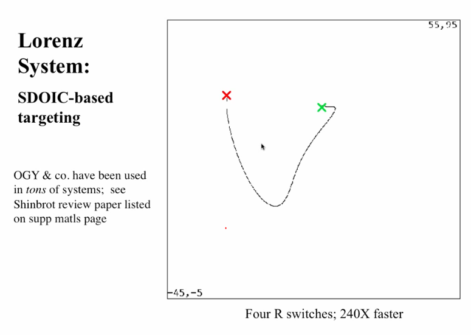
    - AI tool has been used to implement OGY control

## TODO

- Try [TISEAN](https://www.pks.mpg.de/~tisean/Tisean_3.0.1/index.html)