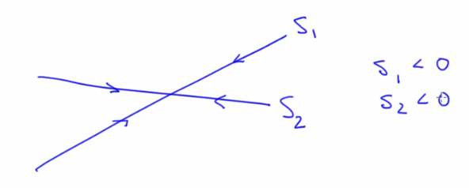

# Course on Nonlinear Dynamics: Mathematical and Computational Approaches

My progress and notes from the [course on nonlinear dynamics](https://www.complexityexplorer.org/courses/100-nonlinear-dynamics-mathematical-and-computational-approaches) offered by the Santa Fe Institute.

Code files are present [here](./code)

- [Terminology](#terminology)
- [Learning that made this course very interesting](#learning-that-made-this-course-very-interesting)
- [Intro](#intro)
- [Maps (Discrete time intervals; Modelled using Difference equations)](#maps-discrete-time-intervals-modelled-using-difference-equations)
  - [Concepts](#concepts)
  - [Return Maps](#return-maps)
    - [Time Domain Plots and their return map equivalent](#time-domain-plots-and-their-return-map-equivalent)
  - [Bifurcation Diagram](#bifurcation-diagram)
    - [Feigenbaum and universality](#feigenbaum-and-universality)
      - [Manifestations of Universality of Chaos (Eg. Feigenbaum number)](#manifestations-of-universality-of-chaos-eg-feigenbaum-number)
- [Flows (Continuous time; Modelled using Differential equations)](#flows-continuous-time-modelled-using-differential-equations)
  - [Fundamentals](#fundamentals)
  - [State variables and state space](#state-variables-and-state-space)
  - [ODE and Dynamical system](#ode-and-dynamical-system)
  - [Fixed points and stability](#fixed-points-and-stability)
  - [Saddle points and Eigen vectors](#saddle-points-and-eigen-vectors)
  - [Stable and Unstable Manifolds of Fixed points](#stable-and-unstable-manifolds-of-fixed-points)
  - [Attractors](#attractors)

## Terminology

| Term | Definition   |
|---|---|
| Deterministic  | A system that is not random. Cause & Effect are linked. Current state determines future state  |
| Nonlinear | A system that with relationships between variables that matter are nonlinear |
| Dynamic(al) | A system that evolves with time|
| Phase space | Also known as State Space, used to describe evolution of trajectory of dynamical systems. For a standard map, the statespace is the x,y-axes|
| Sparatrix | Curve in state space that separates two different regions|
| Integrable| Not chaotic|
| Disspative| Friction, necessary condition for the existence of attractors but not for the existence of chaos |
| Hamiltonian | Synonym for conservative/non-dissipative|
| Conservation | No friction, Ideal|
| Nonintegrability | Applies to only non-dissipative/hamiltonian systems. Think of it as "can't be solved in closed form/analytically"|

Nonlinearity is a necessary condition for chaos. Not all nonlinear systems are chaotic

Non integrabilitiy (if the ODE is non linear, possible that there might not exist an **analytic** solution) is a necessary and sufficient condition for chaos. Such ODE's are solved **numerically** (with a computer)

## Learning that made this course very interesting

Concepts learnt:
maps, return maps, logistic map, bifurcation diagram, time series analysis, dynamical systems, chaos, feigenbaum number, universality, standard maps, flows, [linear algebra,matrices,ODE] in the context on linear dynamics, numerical analysis

- Manifestations of Universality of Chaos
- NLD is in weather, flows (air,fluid), non linear oscillators (pendula, human heart, fireflies, electronic systems), protein folding, classical mechanics (three-body problem, paired black holes) etc.
- The course goes over terminology very carefully (eg. sensitivity to initial conditions) and explains the fundaments of systems. Adds analysis structure to understanding patterns such as the butterfly effect for example.
- NLD developed in the 1960's as a result of computers, which are absolutely essential to solve non-integrable ODE's numerically. Experimental Mathematics relies on the computer as the laboratory
- Problems like an artifical pancreas aid for diabetes are difficult because the response of human body to insulin is non-linear. ODE's have reduced the necessity for animal testing. A very interesting [application](https://www.youtube.com/watch?v=a790FlSLIQo) of ODE's. The role of computers in such applications is amazing!
- Using stable and unstable manifolds to design [spacecraft trajectories](https://www.youtube.com/watch?v=PRbAag_crbo) (with Jeff Parker)

## Intro

- **Chaos** - Complex behavior, arising in a deterministic nonlinear dynamic (NLD) system with 2 properties: **sensitive dependence on initial conditions** (butterfly effect, trajectory changes based on initial condition) and characteristic structure. Systems that exhibit chaos are ubiquitous
- Systems: 
- Derivatives represent the math of change with time
- **Complexity** (complicated systems with simple behavior) **vs Chaos** (simple systems with complex behavior)
- Flow (continuous in time) vs Maps (discrete time intervals with no knowledge of state of the system between intervals)

## Maps (Discrete time intervals; Modelled using Difference equations)

- Difference Equation: xn+1 = f    (xn).
- Logistic Map: xn+1 = R xn(1-xn). Repetition converges to a fixed point from a transient phase. [Try this simulator](./code/Logistic%20Map%20Sim%20-%20Cobweb%20Plots%20and%20the%20Time%20Domain/Cobweb.html)

### Concepts

- x0,x1,x2.. -> **Orbit**/Trajectory of the dynamical system. Sequence of **state variables**.
- Logistic map has a single state variable x. Other maps such as the [Henon map](https://en.wikipedia.org/wiki/H%C3%A9non_map) have more than one state variable
- Starting state variable is the **initial condition**
- Repetition converges to a fixed point from a transient phase. A fixed point does not move under the influence of dynamics. An **attracting (stable) fixed point** is one that the system tends to go to (eg. rest). Fixed points move with changing parameter R. A fixed point of a map $f$ is a state $x^{*}$ such that $x^{*}=f\left(x^{*}\right)$
- **Transient** -> Fixed results in overshoot/**oscilatory** for higher values of R
- Attractors. Kinds:
  - Attracting fixed points
  - **Basin of attraction**: Different initial points leading to the same fixed point
  - **Periodic orbit** (limit cycle) Period:2(this can be any number based on fixed points)
  - **Chaotic/Strange Attractors** 
- **Bifurcations** - Changes in the topology of the attractor. R is a bifurcation parameter in the logistic map. It affects the dynamic in a fundamental way. Eg. a flooded creek
- Few **representations** to understand NLD:
  - Physical space (Eg. Pendulum)
  - Time Domain Plots ( $x_n$ vs n ) - Shows overall temporal pattern of the iterates
    - Brings out overall behavior of iterates
  - Return Maps (Correlation Plot/ Cobweb diagram) ( $x_{n+1}$ vs $x_n$ (First because of n+1, We can also have second return map etc))
    - Brings out correlation between succesive iterates, geometry of iterates why they go where they go
  - Bifurcation diagram ( $x_n$ vs R). View of a time plot from the side.
    - What changes about the asymptotic behavior of the trajectory as R changes including bifurcations

### Return Maps

- Logistic Map  
- 
- Fixed point condition, xn+1* = xn* (where dynamics dont move)
  
- Points on the curve signify where the iterates are. This is a fixed point (not periodic) because nearby iterates are converging to the same point 
- The spacing between points and tendency to converge will differentiate fixed points from periodic orbits.Slope of the blue curve (parabola) at the fixed point determines if it's a fixed point or not
- Green line indicates the fixed points of the system. Slope of the blue curve (function/parabola) at the intersection of green point and parabola determines whether it is a stable (cobweb) or unstable fixed point
- Periodic Orbit on a return map 
- Second return map example 
- Removing transient points in a cobweb plot will make periodic orbits clearly visible. Example: 

#### Time Domain Plots and their return map equivalent

### Bifurcation Diagram

- Bifurcation point is the point where a fixed point splits into periodic 2 orbit in a xn vs R app
- Bifurcation diagram ignores the transient curve
  - Near a bifurcation point, we notice thickening if insufficient transient is removed
- Fractals are self-similar patterns that become visible in bifurcation diagrams. These are non-integer Hausdorff dimension. Fractals are in nature and also in computer graphics to analogue nature (eg. mandelbrot set)
  - Many (most) chaotic systems have fractal state-space structure. But not all.

- 
- Logistic Map BD features: 
  - Periodic orbit of 2 in fixed points (2,4,8)
  - Periodic orbit of 3 amongst chaotic points (3,6,12)
  - It is a fractal with period-doubling cascades
  - Dark veils in the logistic map bifurcation diagram are unstable perioid orbits
  - Bifurcations in the cascade are getting smaller (closer) as R increases (and period increases with R)
- Initial points (x0) within the same basin of attractors reach the same fixed point.
- As R increases in logistic map, we see oscillatory convergence and period doubling as visible from both time series and bd
- Differnet x0 follows the same path but in a different order which is why bd are useful compared to timeseries plots

Important aspects of NLD:
- Structure of chaotic attractors
- Sensitive dependance on initial conditions

#### Feigenbaum and universality

$$\lim _{n \rightarrow \infty} \frac{\Delta_{n}}{\Delta_{n+1}}=4.66$$

i.e Widths of the pitchforks.

Feigenbaum number holds true for any **1-D** **map** with a quadratic maximum eg. logistic map, sine map and any other map that looks like a parabola at it's maximum

##### Manifestations of Universality of Chaos (Eg. Feigenbaum number)

Systems as diverse as orbiting moons, human heart, pendulum, hurricanes all act the same in the throws of chaos. This is extremely fascinating.

Example of 2D map: Smale's horshoe kneading moves initial points closer to far apart and vice versa. The stretching and folding that creates this is a paradigm in chaos. **Its the cause of sensitive dependence on initial conditions**. In a logistic map, the quadratic map (like fingers) kneads the unit interval (like dough).

Maps are also useful in modelling physical systems. A good example of this is the standard map that can be used to model an experiment where a pendulum in free space is hit periodically in time (meaning different points in its path) and to model the amplitude and angular momentum impact (extend this to effect of planets on asteroid movement)

Standard map is non-disspative (no attractors) but there is still chaos

## Flows (Continuous time; Modelled using Differential equations)

### Fundamentals

- Constraints in sampling rate/data acquisitions induces the need to rely on discretization to an extent
- State variables in Flows example
  - The double pendulum can be modelled using 4 state variables (Angle of main bob, Angle of second bob relative to main, Angular momentum of both bobs since position alone cannot convey all possible states)
  - **The state variables *EVOLVE* continuosly under the *influence* of the dynamical system**
  - The trajectory of the system is the progression (continuous unlike maps) of states that the dynamical system goes through.
  - The dynamical system goes through a transient (oscillations) before reaching an attractor (stable fixed point at rest). This is only when the initial point is in the basin of attraction (in case of a pendulum this is basically without raising the bob above)
  - Stable fixed points shrink perturbation. Unstable fixed points (3 for example, b,c,d) 
  - A stable fixed point can become chaotic or move to a perioic orbit (at a bifurcation parameter think of this as moving the table on which the pendulum was placed at a frequency, the bob will eventually move). Similarly an unstable fixed point can become stable at a different condition

### State variables and state space

- A powerful representation in the field of non linear dynamics. Supresses time and reveals patterns that emerge as the system evolves with time. Focus of exploration is important while choosing state space in a dynamical system (think of eyes in a potrait drawing)
- Simple pendulum example for state space potrait
  - The states at odd multiples of pi are unstable fixed points and even multiples of pi (theta w.r.t rest condition) are repeated stable fixed points
  - The angular momentum values translate into ellipses around the origin
  - State representation of a simple pendulum 
  - Assumes no friction but real device shows damped oscillation 
  - With no friction, there is no attractor, because there is nothing to cause the transient to die out. The elliptic fixed points in the above image are **NOT ATTRACTIVE** for this reason.
  - A system without friction is called a conservative or hamiltonian system
  - The trajectories demonstrate uniqueness i.e they do not cross and this is a mathematical requirement

### ODE and Dynamical system

- Derivative (slope of x(t), ODE) w.r.t time for dynamical systems. To find the solution we would also need the constant (or x(t) at t=0)
- Any ODE that can be solved analytically on paper is clsoed form by definition not chaotic
- Nonlinearity is a necessary condition for chaos. If an ODE is non linear it is possible there is no analytical solution
- If there is no analytic solution to an ODE, then the ODE is for sure chaotic
- x' = sinx is a nonlinear ODE
- Why ODE?
  - Good models that capture biology, physics, enonomics etc.
- Non linear equation have powers, products of variables or transcedentals (such as sin x)

### Fixed points and stability

- A point in the dynamical system that is stable under the influence of dynamics
- Stable fixed point -> Perturbation shrinks, Unstable fixed point -> Perturbation grows
- Dissipative systems have attractors
- Conservative systems have no friction and hence no attractors. There are still fixed points and chaos though, just that there are no fixed/chaotic attractors.
  - Solar system is a conservative system on human scale. But Pluto's orbit is chaotic.
- Initial condition outside the basin of attraction of a fixed point will not lead to convergence. Think off dynamics as an oddly shaped bowl (the shape defined by the dynamics), where the bottom most point is the fixed point. A trajectory is a ball rolling on the topography/landscape (intuitive shape of the state space) defined by the dynamic. This analogy is useful for 2-D state space.

### Saddle points and Eigen vectors

- Fixed points can either be on a dynamic landscape of:
  - An inverted bowl
  - Saddle (eg. inverted point on a pendulum)
- Matrices affect transformations of space
  - Define computer graphics, the connection goes to the landscape in dynamical systems
  - Eigen means same
    - Eigenvalues:Tells how fast the state travels along the eigenvector and it's direction. Movement along an eigen vector: $e^{s_it}$
      - Imagine a ball rolling from a mountain along a stream. EV at the top would be positive as ball travels away and EV is negative at bottom where ball travels towards. The distance between the ball drop in the stream and the place where we drop it grows exponentially
    - Eigenvectors: A point that starts on an eigenvector stays on the EV. (think of a ball rolling on a landscape)
    - To find EigenValues subtract s from the diagonal elements and calculated the determinate (to get the roots of the characteristic polynomial). Each value has it's own eigen vector. Possibilities (each of these indicate a type of fixed point discussed earlier):
      - e^s shrinks. Both point inwards like a bowl 
        - If s1 & s2 are perpendicular they are a hemispherical bowl
      - Upside down bowl 
      - Saddle 
        - For a pendulum, saddle points are at odd values of theta
        - Eigen values/vectors work when we are looking at a small patch of the system 
        - NonLinear Systems occuring in nature do not have bowl/saddle shapes as they are much more complex and nonlinear.

### Stable and Unstable Manifolds of Fixed points

- Manifolds are surfaces in the state space that are like non-linear generalizations of eigen vectors. They are invariant manifolds i.e state that starts on this manifold stays on that manifold just like an eigen vector
  - Manifolds are useful in determining boundaries of basins of attraction, filtering out noise and controlling chaos
  - 
  - The entire structure above also is usefully in formally proving that a system is chaotic
  - The bends and folds in the manifolds are the source of i) sensitive dependence to initial conditions ii) structure of a chaotic attractor
- Things spread along unstable manifolds and converge along stable manifolds
- Stable manifolds (bowl, converging) - Set of initial conditions such that x->x* as t-> inf
- Unstable manifolds (Upside down bowl,diverging) - Set of initial conditions such that x->x* as t-> -inf while staying on the manifold

### Attractors

- Four kinds of attractors in dissipative nld sytems:
  - Fixed points 
  - Periodic Orbit/ Limit cycle 
  - Chaotic/Strange attractors. Exponential divergence of neighboring trajectories is sensitive dependence to initial conditions 
  - Quasi-Periodic orbitic
- A nonlinear system can have any number of attractors, of all types, sprinkled around the state space. Their basins of attraction partition the state space. There's no way to know where they are, how many there are, what types etc.
- In determininstic dynamical systems and intersection cannot occur in the state space or the orbit because at the intersection there would be two paths for the trajectory which is a violation of determinism