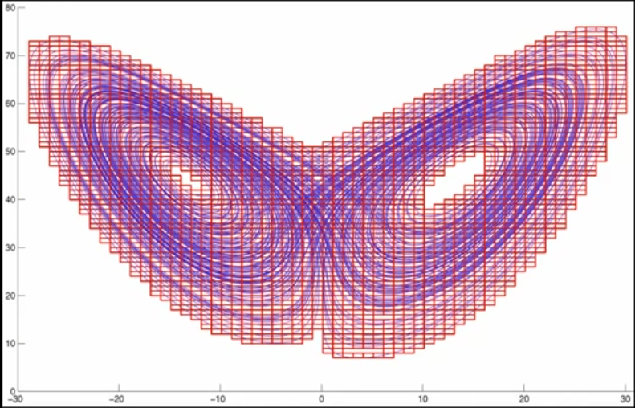
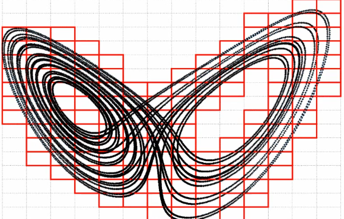

# Finding capacity dimension

Capacity dimension of a 2D projection of a Lorentz attractor. Determine number of boxes and size of each box

Hint: Think of overlaying a pixel-like matrix

Use $x_{\text {curr}} \rightarrow$ ceiling $\left[\frac{x_{\text {curr}}-\text {minx}}{\epsilon}\right]$

## Problem

Implement a function for counting the number of boxes N(є) of side length є needed to cover a two-dimensional trajectory of a dynamical system.  Your code should take the trajectory and an є; it should output N(є).

Download the following trajectory of the Lorenz system, CapDimData.dat

The first column is the x-coordinate, the second the y-coordinate, and the third the z-coordinate.  While the trajectory is three-dimensional, we will only use various two-dimensional projections in this homework in order to make things simple.  The later problems in this homework concern the effects that that projection has upon the fractal dimension.

